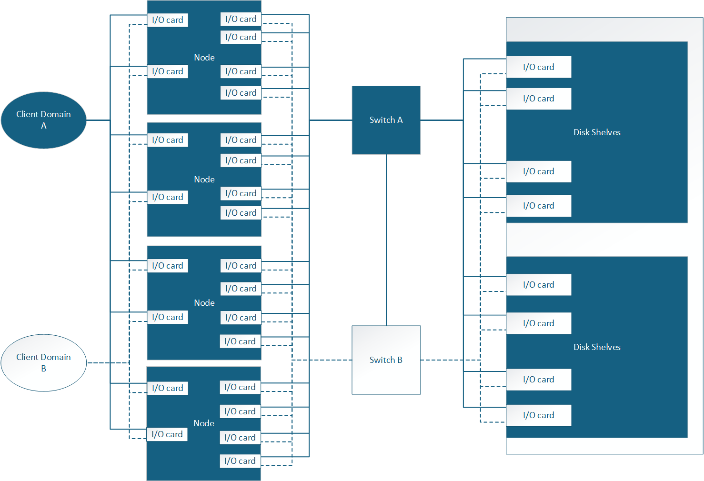

= Overview of cabling for AFX storage system
:icons: font
:imagesdir: ../media/

[.lead]
Learn how to cable your controllers to the network, switches, and drive shelves. 

The initial configuration of the AFK 1k storage system supports four nodes connected through a switch to the drive shelves. Additional node and disk shelf configurations are supported and utilize the same switch-based cabling methodology as the four node schema depicted below. 

== Hardware overview

[options="header"]
|===
a| *Controller Shelf* a| *Drive Shelf* a| *Switch* a| *Cables*
a|
AFK 1k
a|
NX224
a|
Cisco 9332, Cisco 9336
a|
* 400 GbE-based QSFP-DD
* RJ-45 cables
* Cluster/HA interconnect cables
* 
|===