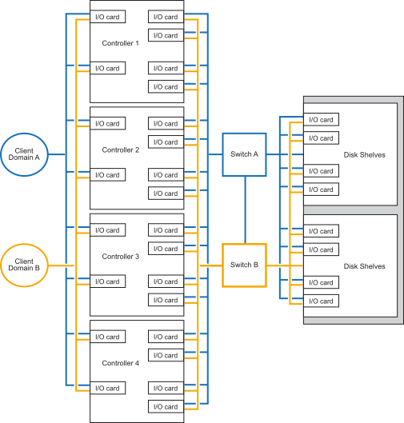

= Supported configurations for your AFX 1K storage system
:icons: font
:imagesdir: ../media/

[.lead]
Learn about the supported hardware components and cabling options for the AFX 1K storage system, including compatible storage disk shelves, switches, and cable types required for proper system setup. 

== Supported AFX 1K cabling configuration
The initial configuration of the AFX 1K storage system supports a minimum of four controller nodes connected through dual switches to the storage disk shelves. 

Additional controller nodes and disk shelves can be used to expand on the initial AFX 1K storage system configuration. Expanded AFX 1K configurations follow the same switch-based cabling methodology as the schema depicted below. 

== Supported hardware components
Review the compatible storage disk shelves, switches, and cable types for the AFX 1K storage system.

[cols="2,2,3,6",options="header"]
|===
a| *Controller Shelf* a| *Disk Shelf* a| *Supported Switches* a| *Supported Cables*
a|
AFX 1K
a|
NX224
a|
* Cisco Nexus 9332D-GX2B (400GbE)
* Cisco Nexus 9364D-GX2A (400GbE)
a|
* 4 x 100GbE QSFP breakout cable cables

NOTE: Breakout cables are used for 100GbE connections between the switches, controllers, and disk shelves. 

* 100GbE cables to controller cluster and HA ports
* 100GbE cables to disk shelves
* 400GbE cables for ISL connections between switch A and switch B 
* RJ-45 cables for management connections
|===

.What's next?
After reviewing the supported system configuration and hardware components, link:install-network-reqs.html[review the network requirements for your AFX 1K storage system].
