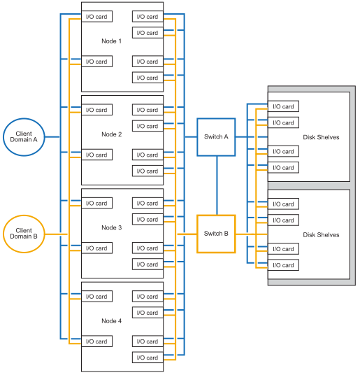

= Supported cabling configuration for your AFX A1K system
:icons: font
:imagesdir: ../media/

[.lead]
Learn about the supported hardware components and cabling options for the AFX 1K storage system, including compatible drive shelves, switches, and cable types required for proper system setup. 

== Supported AFX 1K cabling configuration
The initial configuration of the AFX 1K storage system supports a minimum of four nodes connected through dual switches to the drive shelves. 

Additional nodes and disk shelves can be used to expand on the initial AFX 1K storage system configuration. Expanded AFX 1K configurations follow the same switch-based cabling methodology as the four node schema depicted below. 

== Supported hardware components
Review the compatible drive shelves, switches, and cable types for the AFX 1K storage system.

[options="header"]
|===
a| *Controller Shelf* a| *Drive Shelf* a| *Supported Switches* a| *Supported Cables*
a|
AFX 1k
a|
NX224
a|
* Cisco 9332 (400GbE)
* Cisco 9364 (400GbE)
a|
* 400GbEx100GbE QSFP breakout cable cables

NOTE: Breakout cables are used for connections between the switches, controller, and drive shelf. 

* RJ-45 cables
* Cluster/HA interconnect cables
* ISL cables for connection between switch A and switch B
|===

.What's next?
After reviewing the supported system configuration and hardware components, you link:cable-hardware.html[cable the controllers and storage shelves for your AFX system].
