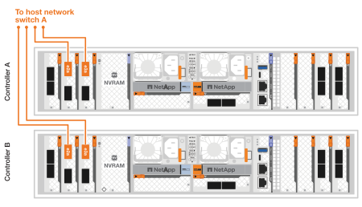
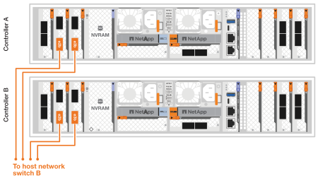
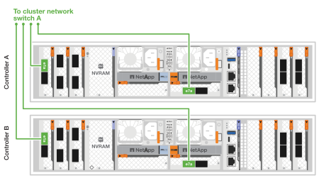
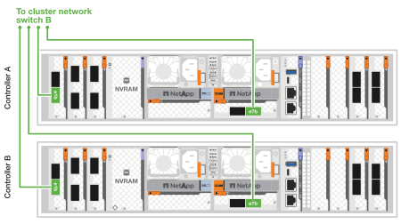
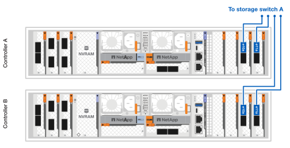
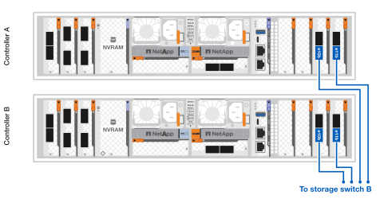
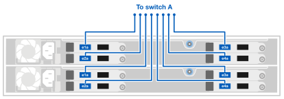
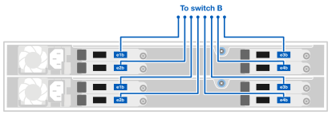

= Cable the hardware for your AFX 1K storage system
:icons: font
:imagesdir: ../media/

[.lead]
After you install the rack hardware for your AFX 1K storage system, install the network cables for the controllers, and connect the cables between the controllers and storage shelves.

.Before you begin

Contact your network administrator for information about connecting the storage system to your network switches.

.About this task
* These procedures show common configurations. The specific cabling depends on the components ordered for your storage system. For comprehensive configuration details and slot priorities, see link:https://hwu.netapp.com[NetApp Hardware Universe^].
* The I/O slots on an AFX controller are numbered 1 through 11.
+
image::../media/drw_a1K_back_slots_labeled_ieops-2162.svg[Slot numbering on an AFX controller]

* The cabling graphics have arrow icons showing the proper orientation (up or down) of the cable connector pull-tab when inserting a connector into a port.
+
As you insert the connector, you should feel it click into place; if you do not feel it click, remove it, turn it over and try again.
+
image:../media/drw_cable_pull_tab_direction_ieops-1699.svg[Cable pull tab direction]

* When cabling to an optical fiber connection, insert the optical transceiver into the controller port before cabling to the switch port.

* The AFX 1K storage system utilizes 4x100GbE breakout cables on the cluster and storage network. The 400GbE connections are made to the switch ports, and the 100GbE connections are made to the controller and drive shelf ports. Storage and HA/Cluster connections can be made to any non-ISL port on the switch.
+
For a given 4x100GbE breakout cable connection to the specific switch port, you connect all 4 ports going to the switch over this single breakout cable.

** 1 x HA port (slot 1)
** 1 x cluster port (slot 7)
** 2 X storage ports (slots 10, 11) 
+
All 'a' ports connect to switch A, and all 'b' ports connect to switch B.

NOTE: Cisco Nexus 9332D-GX2B and 9364D-GX2A switch configurations to the AFX 1K system require 4x100GbE breakout cable connections.

== Step 1: Connect the controllers to the management network
Connect the management port on each switch to either of the management switches (if ordered) or connect them directly to your management network.

The management port is the upper-right port located on the PSU side of the switch. The CAT6 cable for each switch needs to be routed through the pass-through panel after the switches are installed to connect to the management switches or management network.

Use the 1000BASE-T RJ-45 cables to connect the management (wrench) ports on each controller to the management network switches.

image::../media/oie_cable_rj45.png[RJ-45 cables,width=100px]
*1000BASE-T RJ-45 cables*

image::../media/drw_afx_management_connection_ieops-2349.svg[Connect to your management network]

IMPORTANT: Do not plug in the power cords yet. 

. Connect to host network. 

== Step 2: Connect the controllers to the host network
Connect the Ethernet module ports to your host network. 

This procedure differs depending on your storage system model and I/O module configuration. The following are some typical host network cabling examples. See  link:https://hwu.netapp.com[NetApp Hardware Universe^] for your specific system configuration.

.Steps

. Connect the following ports to your Ethernet data network switch A.
* Controller A (example)
** e2a
** e3a
* Controller B (example)
** e2a
** e3a
+
*100GbE cables*
+
image::../media/oie_cable100_gbe_qsfp28.png[100 Gb Ethernet cable]
+

. Connect the following ports to your Ethernet data network switch B.
* Controller A (example)
** e2b
** e3b
* Controller B (example)
** e2b
** e3b
+
*100GbE cables*
+
image::../media/oie_cable100_gbe_qsfp28.png[100 Gb Ethernet cable]
+

== Step 3: Cable the cluster and HA connections
Use the Cluster and HA interconnect cable to connect ports e1a and e7a to switch A and e1b and e7b to switch B. The e1a/e1b ports are used for the HA connections, and the e7a/e7b ports are used for the cluster connections.

.Steps

. Connect the following ports to cluster network any non-ISL port on switch A.
* Controller A
** e1a
** e7a
* Controller B
** e1a
** e7a 
+
*100GbE cables*
+
image::../media/oie_cable_25Gb_Ethernet_SFP28_ieops-1069.png[Cluster HA cable]
+

. Connect the following ports to cluster network any non-ISL port on switch B.
* Controller A
** e1b
** e7b
* Controller B
** e1b
** e7b 
+
*100GbE cables*
+
image::../media/oie_cable_25Gb_Ethernet_SFP28_ieops-1069.png[Cluster HA cable]
+

== Step 4: Cable the controller-to-switch connections
Connect the controller storage ports to the switches.  Make sure you have the appropriate number and type of cables and cable connectors for your switches. See https://hwu.netapp.com[Hardware Universe^] for more information.

. Connect the following storage ports to any non-ISL port on switch A.
* Controller A
** e10a
** e11a
* Controller B
** e10a
** e11a 
+
*100GbE cables*
+
image::../media/oie_cable100_gbe_qsfp28.png[100 Gb cable]
+

. Connect the following storage ports to any non-ISL port on switch B.
* Controller A
** e10b
** e11b
* Controller B
** e10b
** e11b 
+
*100GbE cables*
+
image::../media/oie_cable100_gbe_qsfp28.png[100 Gb cable]
+

== Step 5: Cable the shelf-to-switch connections
Connect the NX224 storage shelves to the switches.   

For the maximum number of shelves supported for your storage system and for all of your cabling options, see link:https://hwu.netapp.com[NetApp Hardware Universe^].

. Connect the following shelf ports to any non-ISL port on switch A.
* Module A
** e1a
** e2a
** e3a
** e4a
* Module B
** e1a
** e2a
** e3a
** e4a
+
*100GbE cables*
+
image::../media/oie_cable100_gbe_qsfp28.png[100 Gb cable]
+

. Connect the following shelf ports to any non-ISL port on switch B.
* Module A
** e1b
** e2b
** e3b
** e4b
* Module B
** e1b
** e2b
** e3b
** e4b
+ 
*100GbE cables*
+
image::../media/oie_cable100_gbe_qsfp28.png[100 Gb cable]
+

.What's next?

After you’ve cabled the hardware, you link:power-on-configure-switch.html[power on and configure the switches for your AFX 1K system].
