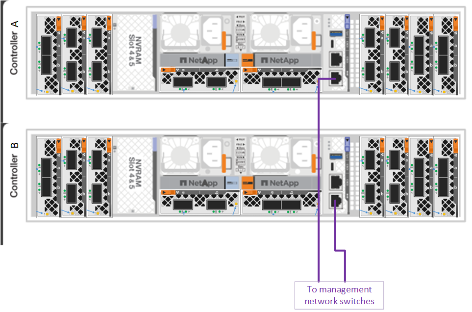
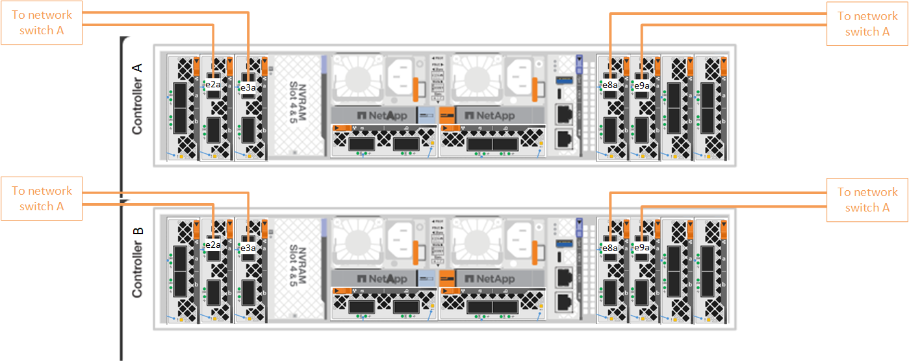
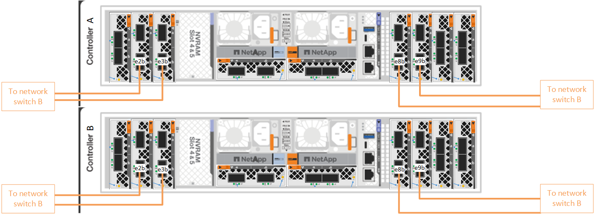
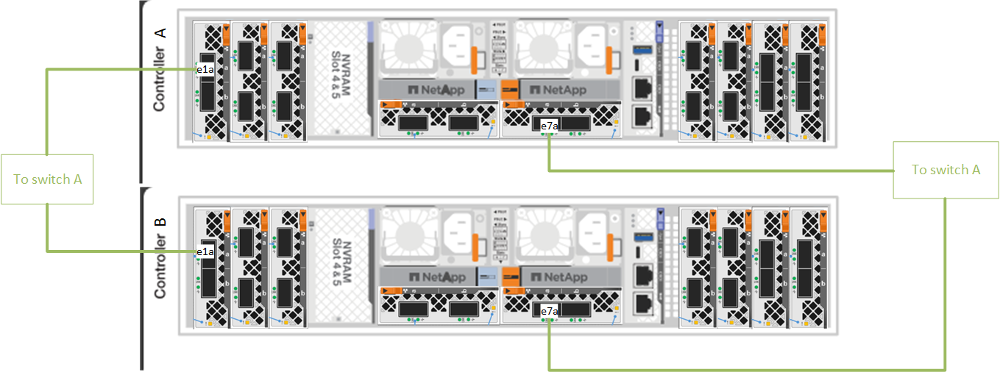
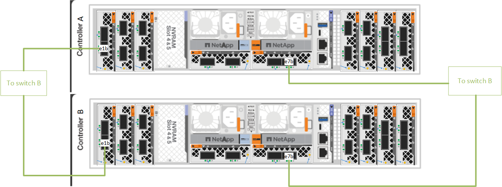
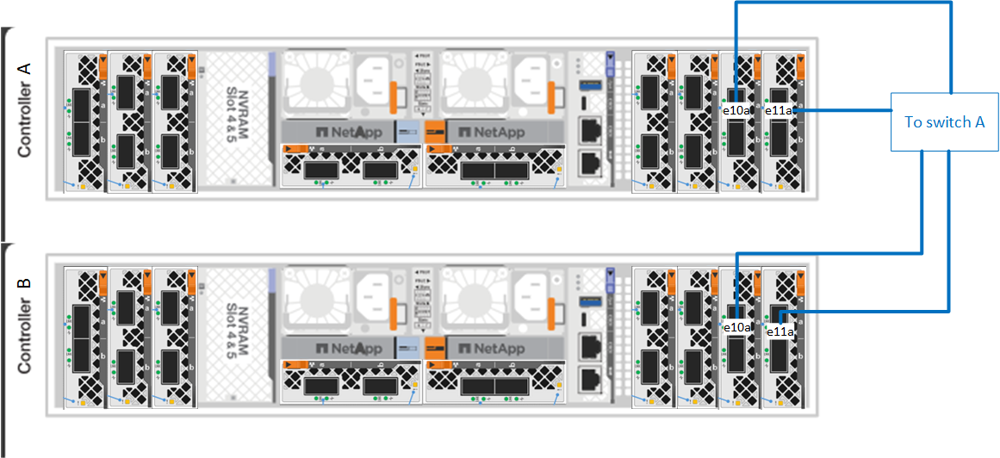
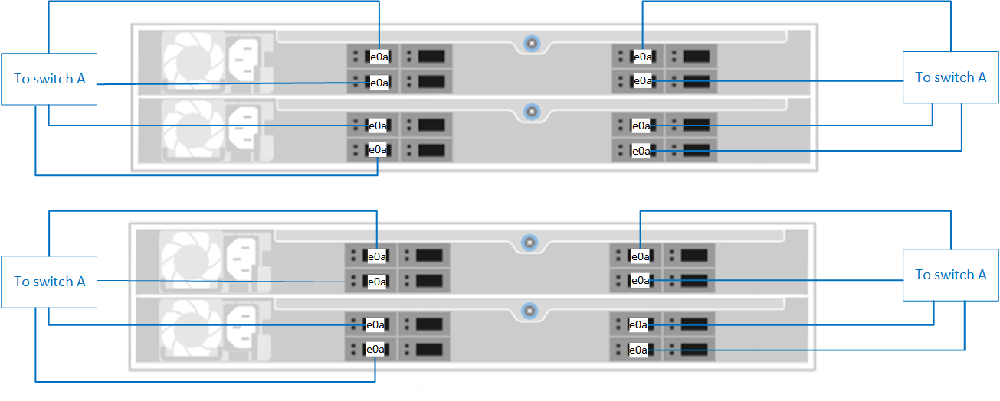
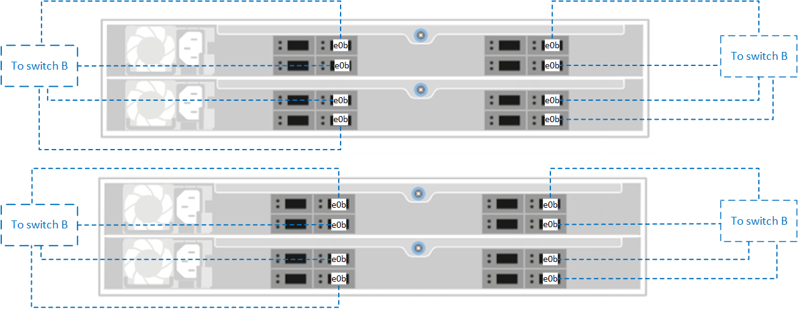

= Cable the hardware for your AFX storage system
:icons: font
:imagesdir: ../media/

[.lead]
After you install the rack hardware for your AFX storage system, install the network cables for the controllers, and connect the cables between the controllers and storage shelves.

.Before you begin

Contact your network administrator for information about connecting the storage system to your network switches.

.About this task
* These procedures show common configurations. The specific cabling depends on the components ordered for your storage system. For comprehensive configuration details and slot priorities, see link:https://hwu.netapp.com[NetApp Hardware Universe^].
* The I/O slots on an AFX controller are numbered 1 through 11.
+
image::../media/drw_a1K_back_slots_labeled_ieops-2162.svg[Slot numbering on an AFX controller]

* The cabling graphics have arrow icons showing the proper orientation (up or down) of the cable connector pull-tab when inserting a connector into a port.
+
As you insert the connector, you should feel it click into place; if you do not feel it click, remove it, turn it over and try again.
+
image:../media/drw_cable_pull_tab_direction_ieops-1699.svg[Cable pull tab direction]

* If cabling to an optical switch, insert the optical transceiver into the controller port before cabling to the switch port.

== Step 1: Connect the controllers to the management network
Use the 1000BASE-T RJ-45 cables to connect the management (wrench) ports on each controller to the management network switches.

image::../media/oie_cable_rj45.svg[RJ-45 cables,width=100px]
*1000BASE-T RJ-45 cables*

IMPORTANT: Do not plug in the power cords yet. 

== Step 2: Connect the controllers to the host network
Connect the Ethernet module ports to your host network. 

This procedure differs depending on your storage system model and I/O module configuration. The following are some typical host network cabling examples. See  link:https://hwu.netapp.com[NetApp Hardware Universe^] for your specific system configuration.

.Steps

. Connect the following ports to your Ethernet data network switch A.
* Controller A
** e2a
** e3a
** e8a
** e9a
* Controller B
** e2a
** e3a
** e8a
** e9a 
+
*200 GbE cable*
+
image::../media/oie_cable_sfp_gbe_copper.svg[100Gb Ethernet cable]
+

. Connect the following ports to your Ethernet data network switch B.
* Controller A
** e2b
** e3b
** e8b
** e9b
* Controller B
** e2b
** e3b
** e8b
** e9b 
+
*200 GbE cable*
+
image::../media/oie_cable_sfp_gbe_copper.svg[100Gb Ethernet cable]
+

== Step 3: Cable the cluster/HA connections
Use the Cluster/HA interconnect cable to connect ports e1a and e7a to the switch A and switch B.

.Steps

. Connect the following ports to cluster network switch A.
* Controller A
** e1a
** e7a
* Controller B
** e1a
** e7a 
+
*Cluster/HA interconnect cables*
+
image::../media/oie_cable_25Gb_Ethernet_SFP28_ieops-1069.png[Cluster HA cable]
+

. Connect the following ports to cluster network switch B.
* Controller A
** e1b
** e7b
* Controller B
** e1b
** e7b 
+
*Cluster/HA interconnect cables*
+
image::../media/oie_cable_25Gb_Ethernet_SFP28_ieops-1069.png[Cluster HA cable]
+

== Step 4: Cable the controller storage to switch connections
Connect the controller storage ports to the switches. 

. Connect the following storage ports to switch A.
* Controller A
** e10a
** e11a
* Controller B
** e10a
** e11a 
+
*200 GbE cable*
+
image::../media/oie_cable100_gbe_qsfp28.png[200 Gb cable]
+

. Connect the following storage ports to switch B.
* Controller A
** e10b
** e11b
* Controller B
** e10b
** e11b 
+
*200 GbE cable*
+
image::../media/oie_cable100_gbe_qsfp28.png[200 Gb cable]
+
image::../media/drw_afx_controller_storage_cabling_B_ieops.png[Cable controller storage to switch B]

== Step 5: Cable the shelf-to-switch connections
Connect the NX224 storage shelves to the switches.   

For the maximum number of shelves supported for your storage system and for all of your cabling options, see link:https://hwu.netapp.com[NetApp Hardware Universe^].

. Connect port e0a on the shelf to the switch A.
+
*200 GbE QSFP28 copper cables*
+
image::../media/oie_cable100_gbe_qsfp28.png[200 GbE QSFP28 copper cable]
+

. Connect port e0b on the shelf to the switch B.
+ 
*200 GbE QSFP28 copper cables*
+
image::../media/oie_cable100_gbe_qsfp28.png[200 GbE QSFP28 copper cable]
+

.What's next?

After you’ve cabled the hardware for your AFF AFK A1K system, you link:/power-on-hardware.html[power on the AFX A1K storage system].
