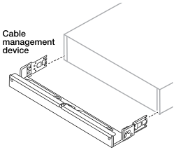

= Install your AFX 1K storage system
:icons: font
:imagesdir: ../media/

[.lead]
After you install the switches, you should install the hardware for your AFX 1K storage system. First, install the rail kits. Then install and secure your storage system in a cabinet or telco rack.

.Before you begin

* Make sure you have the instructions packaged with the rail kit.

* Be aware of the safety concerns associated with the weight of the storage system and storage shelf.

* Understand that the airflow through the storage system enters from the front where the bezel or end caps are installed and exhausts out the rear where the ports are located.

.Steps

. Install the rail kits for your storage system and storage shelves, as needed, using the instructions included with the kits.

. Install and secure your controller in the cabinet or telco rack:

.. Position the storage system onto the rails in the middle of the cabinet or telco rack, and then support the storage system from the bottom and slide it into place.

.. Secure the storage system to the cabinet or telco rack using the included mounting screws.

+
. Attach the bezel to the front of the controller.
+
. If your AFX 1K storage system came with a cable management device, attach it to the rear of the storage system.
+

+
. Install and secure the storage shelf:
+

.. Position the back of the storage shelf onto the rails, and then support the shelf from the bottom and slide it into the cabinet or telco rack.
+
In general, storage shelves and controllers should be installed in close proximity to the switches. If you are installing multiple storage shelves, place the first storage shelf directly above the controllers. Place the second storage shelf directly under the controllers. Repeat this pattern for any additional storage shelves.

.. Secure the storage shelf to the cabinet or telco rack using the included mounting screws.

.What's next?
After you've installed the hardware for your AFX system, reveiw the link:afx-cable-overview.html[supported cabling configurations for your AFX 1K system].

// 2024 Sept 23, ONTAPDOC 1922