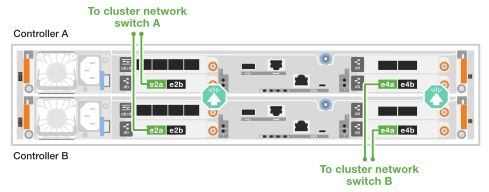
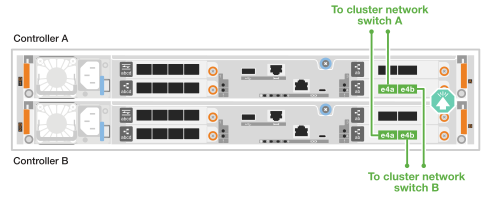
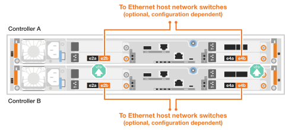
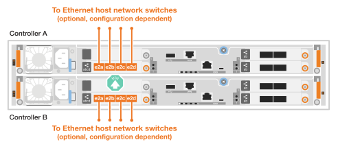
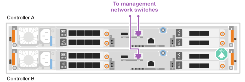
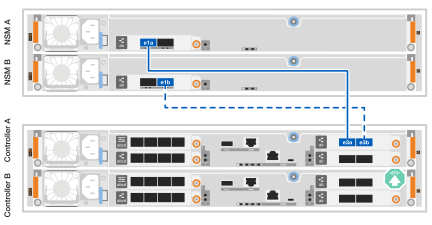

= Cable the hardware - AFF C30 and AFF C60
:icons: font
:imagesdir: ../media/

[.lead]
After you install your AFF C30 or AFF C60 storage system hardware, cable the controllers to the network and shelves.

.Before you begin

Contact your network administrator for information about connecting the storage system to your network switches.

.About this task

* The cabling graphics have arrow icons showing the proper orientation (up or down) of the cable connector pull-tab when inserting a connector into a port.
+
As you insert the connector, you should feel it click into place; if you do not feel it click, remove it, turn it over and try again.
+
image:../media/drw_cable_pull_tab_direction_ieops-1699.svg[Cable pull tab direction]

* If cabling to an optical switch, insert the optical transceiver into the controller port before cabling to the switch port.

== Step 1: Cable the cluster/HA connections
Create the ONTAP cluster connections. For switchless clusters, connect the controllers to each other. For switched clusters, connect the controllers to the cluster network switches.

[NOTE]
====
The cluster/HA cabling examples show common configurations. 

If you do not see your configuration here, go to link:https://hwu.netapp.com[NetApp Hardware Universe^] for comprehensive configuration and slot priority information to cable your storage system.
====

[role="tabbed-block"]
====
.Switchless cluster cabling
--
Use this cabling option when the two controllers are directly connected to each other without using cluster network switches.

.AFF C30 or AFF C60 with two 2-port 40/100 GbE I/O modules
Cable the cluster/HA interconnect ports on the I/O modules in slots 2 and 4.

NOTE: The cluster interconnect traffic and the HA traffic share the same physical ports (on the I/O modules in slots 2 and 4). The ports are 40/100 GbE. 

.Steps
. Cable controller A port e2a to controller B port e2a.
. Cable controller A port e4a to controller B port e4a.
+
NOTE: I/O module ports e2b and e4b are unused and available for host network connectivity.
+
*100 GbE Cluster/HA interconnect cables*
+
image::../media/oie_cable100_gbe_qsfp28.png[Cluster HA 100 GbE cable]
+
image::../media/drw_isi_a30-50_switchless_2p_100gbe_2card_cabling_ieops-2011.svg[c30 and c60 switchless cluster cabling diagram using two 100gbe io modules]

.AFF C30 or AFF C60 with one 2-port 40/100 GbE I/O module
Cable the cluster/HA interconnect ports on the I/O module in slot 4.

NOTE: The cluster interconnect traffic and the HA traffic share the same physical ports (on the I/O module in slot 4). The ports are 40/100 GbE.

.Steps
. Cable controller A port e4a to controller B port e4a.
. Cable controller A port e4b to controller B port e4b.
+
*100 GbE Cluster/HA interconnect cables*
+
image::../media/oie_cable100_gbe_qsfp28.png[Cluster HA 100 GbE cable]
+
image::../media/drw_isi_a30-50_switchless_2p_100gbe_1card_cabling_ieops-1925.svg[c30 and c60 switchless cluster cabling diagram using one 100gbe io module]
--

.Switched cluster cabling
--
Use this cabling option when the controllers connect to cluster network switches instead of being directly connected to each other.

.AFF C30 or AFF C60 with two 2-port 40/100 GbE I/O modules
Cable the cluster/HA interconnect ports on the I/O modules in slots 2 and 4 to the cluster network switches.

NOTE: The cluster interconnect traffic and the HA traffic share the same physical ports (on the I/O modules in slots 2 and 4). The ports are 40/100 GbE.

.Steps

. Cable controller A port e4a to cluster network switch A.
. Cable controller A port e2a to cluster network switch B.
. Cable controller B port e4a to cluster network switch A.
. Cable controller B port e2a to cluster network switch B.
+
NOTE: I/O module ports e2b and e4b are unused and available for host network connectivity.
+
*40/100 GbE Cluster/HA interconnect cables*
+
image::../media/oie_cable100_gbe_qsfp28.png[Cluster HA 40/100 GbE cable]
+

.AFF C30 or AFF C60 with one 2-port 40/100 GbE I/O module
Cable the cluster/HA interconnect ports on the I/O module in slot 4 to the cluster network switches.

NOTE: The cluster interconnect traffic and the HA traffic share the same physical ports (on the I/O module in slot 4). The ports are 40/100 GbE.

.Steps
. Cable controller A port e4a to cluster network switch A. 
. Cable controller A port e4b to cluster network switch B.
. Cable controller B port e4a to cluster network switch A. 
. Cable controller B port e4b to cluster network switch B.
+
*40/100 GbE Cluster/HA interconnect cables*
+
image::../media/oie_cable100_gbe_qsfp28.png[Cluster HA 40/100 GbE cable]
+

--
====

== Step 2: Cable the host network connections
Cable the controllers to your Ethernet or FC host network.

[NOTE]
====
The host network cabling examples show common configurations. 

If you do not see your configuration here, go to link:https://hwu.netapp.com[NetApp Hardware Universe^] for comprehensive configuration and slot priority information to cable your storage system.
====

[role="tabbed-block"]
====
.Ethernet host cabling
--
Connect the controllers to your Ethernet host network using the appropriate ports based on your I/O module configuration.

.AFF C30 or AFF C60 with two 2-port 40/100 GbE I/O modules
On each controller, cable ports e2b and e4b to the Ethernet host network switches.

NOTE: The ports on I/O modules in slot 2 and 4 are 40/100 GbE (host connectivity is 40/100 GbE).

*40/100 GbE cables*

image::../media/oie_cable_sfp_gbe_copper.png[40/100 Gb cable]

.AFF C30 or AFF C60 with one 4-port 10/25 GbE I/O module
On each controller, cable ports e2a, e2b, e2c and e2d to the Ethernet host network switches.

*10/25 GbE cables*

image:../media/oie_cable_sfp_gbe_copper.png[GbE SFP copper connector]

--

.FC host cabling
--
Connect the controllers to your Fibre Channel host network using the FC I/O module in your system.

.AFF C30 or AFF C60 with one 4-port 64 Gb/s FC I/O module
On each controller, cable ports 2a, 2b, 2c and 2d to the FC host network switches.

*64 Gb/s FC cables*

image:../media/oie_cable_sfp_gbe_copper.png[64 Gb fc cable]

image::../media/drw_isi_a30-50_4p_64gb_fc_1card_cabling_ieops-1924.svg[Cable to 64gb fc host network switches]
--
====

== Step 3: Cable the management network connections
Cable the management (wrench) ports on each controller to the management network switches.

*1000BASE-T RJ-45 cables*

image::../media/oie_cable_rj45.png[RJ-45 cables]

// [Connect to your management network] or xx

IMPORTANT: Do not plug in the power cords yet. 

== Step 4: Cable the shelf connections
This procedure shows you how to cable the controllers to one NS224 shelf.

.About this task

* For the maximum number of shelves supported for your storage system and for all of your cabling options, such as optical and switch-attached, see link:https://hwu.netapp.com[NetApp Hardware Universe^].

* The NS224 shelf cabling procedure shows NSM100B modules instead of NSM100 modules. The cabling is the same regardless of the type of NSM modules used, only the port names are different: 
** NSM100B modules use ports e1a and e1b on an I/O module in slot 1.
** NSM100 modules use built-in (onboard) ports e0a and e0b.

* You cable each controller to each NSM module on the NS224 shelf using the storage cables that came with your storage system, which could be the following cable type:
+
*100 GbE QSFP28 copper cables*
+
image::../media/oie_cable100_gbe_qsfp28.png[100 GbE QSFP28 copper cable]
* The graphics show controller A cabling in blue and controller B cabling in yellow. 

.Steps

. Cable controller A port e3a to NSM A port e1a.
. Cable controller A port e3b to NSM B port e1b.
+

. Cable controller B port e3a to NSM B port e1a.
. Cable controller B port e3b to NSM A port e1b.
+
image:../media/drw_isi_g_1_ns224_controller_b_cabling_ieops-1946.svg[Controller B ports e3a and e3b cabled to one NS224 shelf]

.What's next?

After you’ve cabled the hardware for your storage system, you link:install-power-hardware.html[power on the storage system].

//May 21, 2025 GH issue #350