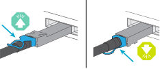
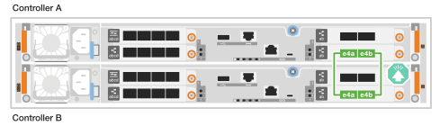

= Cable the hardware - AFF C30 and AFF C60
:icons: font
:imagesdir: ../media/

[.lead]
After you install your AFF C30 or AFF C60 storage system hardware, cable the controllers to the network and shelves.

.Before you begin

Contact your network administrator for information about connecting the storage system to your network switches.

.About this task
* The cluster/HA and host network cabling procedures show common configurations. Keep in mind that the specific cabling depends on the components ordered for your storage system. For comprehensive configuration and slot priority details, see link:https://hwu.netapp.com[NetApp Hardware Universe^].

* The cabling graphics have arrow icons showing the proper orientation (up or down) of the cable connector pull-tab when inserting a connector into a port.
+
As you insert the connector, you should feel it click into place; if you do not feel it click, remove it, turn it over and try again.
+

* If cabling to an optical switch, insert the optical transceiver into the controller port before cabling to the switch port.

== Step 1: Cable the cluster/HA connections
Cable the controllers to your ONTAP cluster. This procedure differs depending on your storage system model and I/O module configuration.

//open tabbed block 
[role="tabbed-block"]
=====
.Switchless cluster cabling
--

.AFF C30 or AFF C60 with two 2-port 40/100 GbE I/O modules
[%collapsible]

====
Cable the controllers to each other to create the ONTAP cluster connections.

.Steps

. Cable the Cluster/HA interconnect connections: 
+
NOTE: The cluster interconnect traffic and the HA traffic share the same physical ports (on the I/O modules in slots 2 and 4). The ports are 40/100 GbE. 
+
.. Cable controller A port e2a to controller B port e2a.
.. Cable controller A port e4a to controller B port e4a.
+
NOTE: I/O module ports e2b and e4b are unused and available for host network connectivity.
+
*100 GbE Cluster/HA interconnect cables*
+
image::../media/oie_cable100_gbe_qsfp28.png[Cluster HA 100 GbE cable, width=100pxx]
+
image::../media/drw_isi_a30-50_switchless_2p_100gbe_2card_cabling_ieops-2011.svg[a30 and a50 switchless cluster cabling diagram using two 100gbe io modules]

====

.AFF C30 or AFF C60 with one 2-port 40/100 GbE I/O module
[%collapsible]

====
Cable the controllers to each other to create the ONTAP cluster connections.

.Steps

. Cable the Cluster/HA interconnect connections: 
+
NOTE: The cluster interconnect traffic and the HA traffic share the same physical ports (on the I/O module in slot 4). The ports are 40/100 GbE.
+
.. Cable controller A port e4a to controller B port e4a.
.. Cable controller A port e4b to controller B port e4b.
+
*100 GbE Cluster/HA interconnect cables*
+
image::../media/oie_cable100_gbe_qsfp28.png[Cluster HA 100 GbE cable, width=100pxx]
+

====

.AFF C30 with one 2-port 10/25 GbE I/O module
[%collapsible]

====
Cable the controllers to each other to create the ONTAP cluster connections.

.Steps
. Cable the Cluster/HA interconnect connections: 
+
NOTE: The cluster interconnect traffic and the HA traffic share the same physical ports (on the I/O module in slot 4). The ports are 10/25 GbE.
+
.. Cable controller A port e4a to controller B port e4a.
.. Cable controller A port e4b to controller B port e4b.
+
*25 GbE Cluster/HA interconnect cables*
+
image:../media/oie_cable_sfp_gbe_copper.png[GbE SFP copper connector, width=100px]
+
image::../media/drw_isi_a20_switchless_2p_25gbe_cabling_ieops-2018.svg[a20 switchless cluster cabling diagram using one 25 gbe io module]

====

--
.Switched cluster cabling
--

.AFF C30 or AFF C60 with two 2-port 40/100 GbE I/O modules
[%collapsible]

====
Cable the controllers to the cluster network switches to create the ONTAP cluster connections.

.Steps

. Cable the Cluster/HA interconnect connections: 
+
NOTE: The cluster interconnect traffic and the HA traffic share the same physical ports (on the I/O modules in slots 2 and 4). The ports are 40/100 GbE.
+
.. Cable controller A port e4a to cluster network switch A.
.. Cable controller A port e2a to cluster network switch B.
.. Cable controller B port e4a to cluster network switch A.
.. Cable controller B port e2a to cluster network switch B.
+
NOTE: I/O module ports e2b and e4b are unused and available for host network connectivity.
+
*40/100 GbE Cluster/HA interconnect cables*
+
image::../media/oie_cable100_gbe_qsfp28.png[Cluster HA 40/100 GbE cable, width=100px]
+
image::../media/drw_isi_a30-50_switched_2p_100gbe_2card_cabling_ieops-2013.svg[a30 and a50 switched cluster cabling diagram using two 100gbe io modules]

====

.AFF C30 or AFF C60 with one 2-port 40/100 GbE I/O module
[%collapsible]

====
Cable the controllers to the cluster network switches to create the ONTAP cluster connections.

.Steps

. Cable the controllers to the cluster network switches:
+
NOTE: The cluster interconnect traffic and the HA traffic share the same physical ports (on the I/O module in slot 4). The ports are 40/100 GbE.
+
.. Cable controller A port e4a to cluster network switch A. 
.. Cable controller A port e4b to cluster network switch B.
.. Cable controller B port e4a to cluster network switch A. 
.. Cable controller B port e4b to cluster network switch B.
+
*40/100 GbE Cluster/HA interconnect cables*
+
image::../media/oie_cable100_gbe_qsfp28.png[Cluster HA 40/100 GbE cable, width=100px]
+
image::../media/drw_isi_a30-50_2p_100gbe_1card_switched_cabling_ieops-1926.svg[Cable cluster connections to cluster network,width=500px]

====

.AFF C30 with one 2-port 10/25 GbE I/O module
[%collapsible]
====

Cable the controllers to the cluster network switches to create the ONTAP cluster connections.

. Cable the controllers to the cluster network switches:
+
NOTE: The cluster interconnect traffic and the HA traffic share the same physical ports(on the I/O module in slot 4). The ports are 10/25 GbE.
+
.. Cable controller A port e4a to cluster network switch A. 
.. Cable controller A port e4b to cluster network switch B.
.. Cable controller B port e4a to cluster network switch A. 
.. Cable controller B port e4b to cluster network switch B.
+
*10/25 GbE Cluster/HA interconnect cables*
+
image:../media/oie_cable_sfp_gbe_copper.png[GbE SFP copper connector, width=100px]
+
image:../media/drw_isi_a20_switched_2p_25gbe_cabling_ieops-2019.svg[a20 switched cluster cabling diagram using one 25gbe io module]
+

====
--
=====
//closed tabbed block

== Step 2: Cable the host network connections
Cable the controllers to your host network. 

This procedure differs depending on your storage system model and I/O module configuration.

.AFF C30 or AFF C60 with two 2-port 40/100 GbE I/O modules
[%collapsible]

====

.Steps

. Cable the host network connections.  
+
The following substeps are examples of optional host network cabling. If needed, see link:https://hwu.netapp.com[NetApp Hardware Universe^] for your specific storage system configuration.

.. Optional: Cable controllers to the host network switches.
+
On each controller, cable ports e2b and e4b to the Ethernet host network switches.
+
NOTE: The ports on I/O modules in slot 2 and 4 are 40/100 GbE (host connectivity is 40/100 GbE).
+
*40/100 GbE cables*
+
image::../media/oie_cable_sfp_gbe_copper.png[40/100 Gb cable, width=100px]
+
image::../media/drw_isi_a30-50_host_2p_40-100gbe_2card_cabling_ieops-2014.svg[Cable to 40/100gbe ethernet host network switches]
+
.. Optional: Cable controllers to FC host network switches.
+
On each controller, cable ports 1a, 1b, 1c and 1d  to the FC host network switches.
+
*64 Gb/s FC cables*
+
image:../media/oie_cable_sfp_gbe_copper.png[64 Gb fc cable,width=100px]
+
image::../media/drw_isi_a30-50_4p_64gb_fc_2card_cabling_ieops-2023.svg[Cable a30 or a50 to 64gb fc host network switches using two io modules]

====

.AFF C30 or AFF C60 with one 2-port 10/25 GbE I/O module
[%collapsible]

====

.Steps
. Cable the host network connections.  
+
The following substeps are examples of optional host network cabling. If needed, see link:https://hwu.netapp.com[NetApp Hardware Universe^] for your specific storage system configuration.

.. Optional: Cable controllers to the host network switches.
+
On each controller, cable ports e2a, e2b, e2c and e2d to the Ethernet host network switches.
+
*10/25 GbE cables*
+
image:../media/oie_cable_sfp_gbe_copper.png[GbE SFP copper connector, width=100px]
+
image::../media/drw_isi_a30-50_host_2p_40-100gbe_1card_cabling_ieops-1923.svg[Cable to 40/100gbe ethernet host network switches]
+
.. Optional: Cable controllers to FC host network switches.
+
On each controller, cable ports 1a, 1b, 1c and 1d  to the FC host network switches.
+
*64 Gb/s FC cables*
+
image:../media/oie_cable_sfp_gbe_copper.png[64 Gb fc cable,width=100px]
+
image::../media/drw_isi_a30-50_4p_64gb_fc_1card_cabling_ieops-1924.svg[Cable to 64gb fc host network switches]

====

.AFF C30 with one 2-port 10/25 GbE module
[%collapsible]

====

.Steps
. Cable the host network connections.  
+
The following substeps are examples of optional host network cabling. If needed, see link:https://hwu.netapp.com[NetApp Hardware Universe^] for your specific storage system configuration.

.. Optional: Cable controllers to host network switches.
+
On each controller, cable ports e2a, e2b, e2c and e2d to the Ethernet host network switches.
+
*10/25 GbE cables*  
+
image:../media/oie_cable_sfp_gbe_copper.png[GbE SFP copper connector, width=100pxx]
+
image::../media/drw_isi_a20_host_4p_25gbe_cabling_ieops-2017.svg[Cable a20 to 40/100gbe ethernet host network switches]
+
.. Optional: Cable controllers to FC host network switches.
+
On each controller, cable ports 1a, 1b, 1c and 1d to the FC host network switches.
+
*64 Gb/s FC cables*
+
image:../media/oie_cable_sfp_gbe_copper.png[64 Gb fc cable,width=100pxx]
+
image::../media/drw_isi_a20_4p_64gb_fc_cabling_ieops-2016.svg[Cable a20 to 64gb fc host network switches]

====

== Step 3: Cable the management network connections
Cable the controllers to your management network.

. Cable the management (wrench) ports on each controller to the management network switches.
+
*1000BASE-T RJ-45 cables*
+
image::../media/oie_cable_rj45.png[RJ-45 cables]
+
image::../media/drw_isi_g_wrench_cabling_ieops-1928.svg[Connect to your management network]

// [Connect to your management network,width=500px] or xx

IMPORTANT: Do not plug in the power cords yet. 

== Step 4: Cable the shelf connections
This procedure shows you how to cable the controllers to one NS224 shelf.

.About this task

* For the maximum number of shelves supported for your storage system and for all of your cabling options, such as optical and switch-attached, see link:https://hwu.netapp.com[NetApp Hardware Universe^].

* You cable each controller to each NSM100B module on the NS224 shelf using the storage cables that came with your storage system, which could be the following cable type:
+
*100 GbE QSFP28 copper cables*
+
image::../media/oie_cable100_gbe_qsfp28.png[100 GbE QSFP28 copper cable,width=100px]
* The graphics show controller A cabling in blue and controller B cabling in yellow. 

.Steps

. Cable controller A to the shelf:
.. Cable controller A port e3a to NSM A port e1a.
.. Cable controller A port e3b to NSM B port e1b.
+
image:../media/drw_isi_g_1_ns224_controller_a_cabling_ieops-1945.svg[Controller A ports e3a and e3b cabled to one NS224 shelf]

. Cable controller B to the shelf:
.. Cable controller B port e3a to NSM B port e1a.
.. Cable controller B port e3b to NSM A port e1b.
+
image:../media/drw_isi_g_1_ns224_controller_b_cabling_ieops-1946.svg[Controller B ports e3a and e3b cabled to one NS224 shelf]

.What's next?

After you’ve cabled the hardware for your storage system, you link:install-power-hardware.html[power on the storage system].

