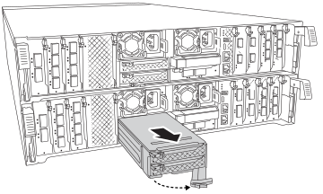

summary: "The NVMe SSD FlashCache module (FlashCache or caching module) contains one or two FlashCache drive carriers wa single SSD caching drive integrated into the carrier.  The FlashCache module is located in slot 6, with the FlashCache drive carriers in Slot 6-1 and/or 6-2 of FAS70 or FAS90 systems only. You can hot-swap the FlashCache module and the individual FlashCache drive carriers with drives of the same capacity from the same or different supported vendor."
---
= Hot-swap a caching module or FlashCache drive carrier - FAS70, FAS90
:icons: font
:imagesdir: ../media/

[.lead]
The NVMe SSD FlashCache module (FlashCache or caching module) contains one or two FlashCache drive carriers with a single SSD FlashCache drive integrated into each FlashCache drive carrier.  The FlashCache module is located in slot 6, with the FlashCache drive carriers in Slot 6-1 and/or 6-2 of FAS70 or FAS90 systems only. You can hot-swap the individual FlashCache drive carriers with drives of the same capacity from the same or different supported vendor.

.Before you begin

Your storage system must meet certain criteria depending on your situation:

* It must have the appropriate operating system for the caching module you are installing.
* The FlashCache module is the carrier for the two FlashCache drive carriers 
* The replacement FlashCache drive carrier must have the same capacity as the failed caching module, but can be from a different supported vendor.
* All other components in the storage system must be functioning properly; if not, you must contact technical support.

[role="tabbed-block"]
====

.Option 1: Replace the FlashCache module
--
== Step 1: Shut down the impaired node

Shut down or take over the impaired controller using one of the following options.

[role="tabbed-block"]
====
--

.Option 1: Most systems
--
include::../_include/shutdown_most_frus_no_PCM_remove.adoc[]
--
.Option 2: Controller is in a MetroCluster
--
include::../_include/shutdown_any_mcc_supported_no_PCM_remove.adoc[]
--

====

== Step 2: Replace the caching module

.Steps
. If you are not already grounded, properly ground yourself.
. Locate the failed caching module, in slot 6, by the lit amber Attention LED on the front of the caching module.

. Remove the failed FlashCache module:
.. Pinch the blue tab at the bottom of the FlashCache module
.. Rotate the tab away from the FlashCache module. 
. Pull the FlashCache module out of the controller module and set it on an antistatic mat.
. Move the FlashCache drive carriers to the replacement FlashCache module:
.. Pinch the Terra Cotta tab at the top of the FlashCache drive carrier and rotate the cam handle away from the FlashCache drive carrier.
.. Remove the module from the enclosure by hooking your finger into the cam lever opening and pulling the module out of the enclosure.
.. Install the FlashCache drive carrier into the same slot in the replacement FlashCache module and rotate the cam handle to the closed position on the FlashCache drive carrier to lock it in place.
. Repeat these steps if there is a second FlashCache drive module
. Install the replacement Caching module into the system:
.. Align the module with the edges of the enclosure slot opening.
.. Gently slide the module into the slot all the way into the enclosure, and then rotate the cam latch all the way up to lock the module in place.

== Step 3: Reboot the controller

After you replace the FlashCache module, you must reboot the controller module.

.Steps

. From the LOADER prompt, reboot the node: _bye_
+
NOTE: This reinitializes the I/O cards and other components and reboots the node.
+
. Return the node to normal operation: _storage failover giveback -ofnode impaired_node_name_

. If automatic giveback was disabled, reenable it: _storage failover modify -node local -auto-giveback true_

== Step 4: Return the failed part to NetApp

include::../_include/complete_rma.adoc[]

--

.Option 2: Replace a FlashCache drive carrier

--

.Steps
. If you are not already grounded, properly ground yourself.
. Locate the failed FlashCache drive carrier, in slot 6, by the lit amber Attention LED on the front of the FlashCache drive carrier.

. Prepare the caching module slot for replacement as follows:
.. Record the caching module capacity, part number, and serial number on the target node: `system node run local sysconfig -av 6`
.. In admin privilege level, prepare the target NVMe slot for removal, responding `y` when prompted whether to continue: `system controller slot module remove -node node_name -slot slot_number` The following command prepares slot 6-1 on node1 for removal, and displays a message that it is safe to remove:
+
----
::> system controller slot module remove -node node1 -slot 6-1

Warning: SSD module in slot 6-1 of the node node1 will be powered off for removal.
Do you want to continue? (y|n): `y`

The module has been successfully removed from service and powered off. It can now be safely removed.
----

.. Display the slot status with the `system controller slot module show` command.
+
The NVMe slot status displays `powered-off` in the screen output for the caching module that needs replacing.

+
NOTE: See the https://docs.netapp.com/us-en/ontap-cli-9121/[Command man pages^] for your version of ONTAP for more details.
. Remove the caching module:

+

+

.. Press the terra cotta release button on the front of the caching module.

.. Rotate the cam handle as far as it will go.
.. Gently pull the cam handle straight toward you to remove the caching module from the controller module.
+
Be sure to support the caching module as you remove it from the controller module.

. Install the caching module:
 .. Align the edges of the caching module with the opening in the controller module.
 .. Gently push the caching module into the bay until the cam handle engages.
 .. Rotate the cam handle until it locks into place.
. Bring the replacement caching module online by using the `system controller slot module insert` command as follows:
+
The following command prepares slot 6-1 on node1 for power-on, and displays a message that it is powered on:
+
----
::> system controller slot module insert -node node1 -slot 6-1

Warning: NVMe module in slot 6-1 of the node localhost will be powered on and initialized.
Do you want to continue? (y|n): `y`

The module has been successfully powered on, initialized and placed into service.
----

. Verify the slot status using the `system controller slot module show` command.
+
Make sure that command output reports status for the as `powered-on` and ready for operation.

. Verify that the replacement caching module is online and recognized, and then visually confirm that the amber attention LED is not lit: `sysconfig -av slot_number`
+
NOTE: If you replace the caching module with a caching module from a different vendor, the new vendor name is displayed in the command output.

include::../_include/complete_rma_step.adoc[]

====
