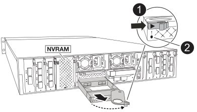

= Replace the FlashCache module carrier or a caching module - FAS70 and FAS90
:icons: font
:imagesdir: ../media/

[.lead]
The NVMe SSD FlashCache module carrier contains one or two FlashCache modules (caching modules) with a single SSD FlashCache drive integrated into each caching module. 

The FAS70 supports 2TB caching modules and FAS90 supports 4TB caching modules. You cannot mix caching modules of different capacity in the FlashCache module carrier.

You can perform either of the following procedures depending on what needs to be replaced: the entire Flashcache module carrier or a caching module.

* <<Replace the FlashCache module carrier>>
* <<Replace the caching module>>

== Replace the FlashCache module carrier
The FlashCache module carrier is located in slot 6 and houses up to FlashCache modules. You cannot hot-swap the FlashCache module carrier 

.Before you begin

* Ensure your storage system has the appropriate operating system for the replacement FlashCache module carrier.
* Confirm all other components are functioning properly; if not, you must contact technical support.

=== Step 1: Shut down the impaired node

Shut down or take over the impaired controller using one of the following options.

 
.Option 1 Most systems
[%collapsible]
====
include::../_include/shutdown_most_frus_no_PCM_remove.adoc[]
====
// End snippet
 
.Option 2 MetroCluster configuration
[%collapsible]
=====
include::../_include/shutdown_any_mcc_supported_no_PCM_remove.adoc[]

// End snippet
=====
=== Step 2: Replace the FlashCache module carrier

Perform the following steps to replace the FlashCache module carrier.

.Steps
. If you are not already grounded, properly ground yourself.
. Locate the failed FlashCache module carrier, in slot 6, by the lit amber Attention LED on the front of the FlashCache module carrier.
+
image::../media/drw_fas70-90_remove_caching_module_carrier_ieops-1772.svg[Remove the FlashCache module carrier]

+
[cols="1,4"]

|===
a|
image:../media/legend_icon_01.svg[Callout number 1, width=30px] 
a|
FlashCache module carrier
a|
image:../media/legend_icon_02.svg[Callout number 2, width=30px]
a|
Caching module slot numbers
a|
image:../media/legend_icon_03.svg[Callout number 3, width=30px]
a|
FlashCache module carrier cam handle
a|
image:../media/legend_icon_04.svg[Callout number 4, width=30px]
a|
FlashCache module carrier fault LED

|===

. Remove the failed FlashCache module carrier:
.. Rotate the cable management tray down by pulling the buttons on both sides on the inside of the cable management tray and then rotate the tray down.
.. Pinch the blue tab at the bottom of the FlashCache module carrier.
.. Rotate the tab away from the module. 
. Pull the FlashCache module carrier out of the controller module and set it on an antistatic mat.
. Move the caching modules to the replacement FlashCache module carrier:
.. Pinch the Terra Cotta tab at the top of the caching module and rotate the cam handle away from the caching module.
.. Remove the module from the enclosure by hooking your finger into the cam lever opening and pulling the module out of the FlashCache module carrier.
.. Install the caching module into the same slot in the replacement FlashCache module carrier and rotate the cam handle to the closed position on the caching module to lock it in place.
. Repeat these steps if there is a second caching module.
. Install the replacement FlashCache module carrier into the system:
.. Align the module with the edges of the enclosure slot opening.
.. Gently slide the module into the slot all the way into the enclosure, and then rotate the cam latch all the way up to lock the module in place.
.. Rotate the cable management tray up to the closed position.

=== Step 3: Reboot the controller

After you replace the FlashCache module carrier, you must reboot the controller module.

.Steps

. From the LOADER prompt, reboot the node: _bye_
+
NOTE: This reinitializes the I/O cards and other components and reboots the node.
+
. Return the node to normal operation: _storage failover giveback -ofnode impaired_node_name_

. If automatic giveback was disabled, reenable it: _storage failover modify -node local -auto-giveback true_

=== Step 4: Return the failed part to NetApp

include::../_include/complete_rma.adoc[]

== Replace the caching module

.Before you begin

The FlashCache modules (caching modules) are located in slot 6-1 or in slot 6-2 or in both slot 6-1 and slot 6-2. 

You can hot-swap the individual caching modules with caching modules of the same capacity from the same vendor or from a different supported vendor.

.Before you begin
* Ensure the replacement caching module has the same capacity as the failed one, from the same vendor or from a different supported vendor.
* Confirm all other components are functioning properly; if not, you must contact technical support.
* The drives in the caching modules are not field replaceable units (FRU). You must replace the entire caching module. 

.Steps

. If you are not already grounded, properly ground yourself.
. Locate the failed caching module, in slot 6, by the lit amber Attention LED on the front of the caching module.

. Prepare the caching module slot for replacement as follows:
.. Record the caching module capacity, part number, and serial number on the target node: _system node run local sysconfig -av 6_
.. In admin privilege level, prepare the target caching module slot for removal, responding `y` when prompted whether to continue: _system controller slot module remove -node node_name -slot slot_number_ The following command prepares slot 6-1 on node1 for removal, and displays a message that it is safe to remove:
+
----
::> system controller slot module remove -node node1 -slot 6-1

Warning: SSD module in slot 6-1 of the node node1 will be powered off for removal.
Do you want to continue? (y|n): _y_
The module has been successfully removed from service and powered off. It can now be safely removed.
----

.. Display the slot status with the `system controller slot module show` command.
+
The caching module slot status displays `powered-off` in the screen output for the caching module that needs replacing.

+
NOTE: See the https://docs.netapp.com/us-en/ontap-cli-9121/[Command man pages^] for your version of ONTAP for more details.
. Remove the caching module:

+

+
[cols="1,4"]

|===
a|
image:../media/legend_icon_01.svg[Callout number 1, width=30px] 
a|
Caching module cam handle
a|
image:../media/legend_icon_02.svg[Callout number 2, width=30px]
a|
Caching module fault LED

|===

.. Rotate the cable management tray down by pulling the buttons on both sides on the inside of the cable management tray and then rotate the tray down.
.. Press the terra cotta release button on the front of the caching module.
.. Rotate the cam handle as far as it will go.
.. Remove the caching module module from the enclosure by hooking your finger into the cam lever opening and pulling the module out of the FlashCache module carrier.
+
Be sure to support the caching module as you remove it from the FlashCache module carrier.

. Install the replacement caching module:
 .. Align the edges of the caching module with the opening in the controller module.
 .. Gently push the caching module into the bay until the cam handle engages.
 .. Rotate the cam handle until it locks into place.
 .. Rotate the cable management tray up to the closed position.

. Bring the replacement caching module online by using the `system controller slot module insert` command as follows:
+
The following command prepares slot 6-1 on node1 for power-on, and displays a message that it is powered on:
+
----
::> system controller slot module insert -node node1 -slot 6-1

Warning: NVMe module in slot 6-1 of the node localhost will be powered on and initialized.
Do you want to continue? (y|n): `y`

The module has been successfully powered on, initialized and placed into service.
----

. Verify the slot status using the `system controller slot module show` command.
+
Make sure that command output reports status for the as `powered-on` and ready for operation.

. Verify that the replacement caching module is online and recognized, and then visually confirm that the amber attention LED is not lit: `sysconfig -av slot_number`
+
NOTE: If you replace the caching module with a caching module from a different vendor, the new vendor name is displayed in the command output.

include::../_include/complete_rma_step.adoc[]
