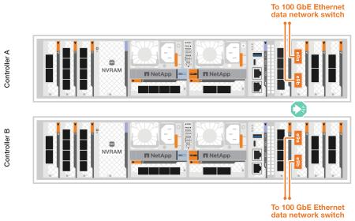

= Cable the hardware - FAS70 and FAS90
:icons: font
:imagesdir: ../media/

[.lead]
After you install the rack hardware for your FAS70 or FAS90 storage system, install the network cables for the controllers, and connect the cables between the controllers and storage shelves.

.Before you begin
Check the illustration arrow in the cabling diagrams for the proper cable connector pull-tab orientation.

image::../media/drw_cable_pull_tab_direction_ieops-1699.svg[Cable pull-tab orientation example]

* As you insert the connector, you should feel it click into place; if you do not feel it click, remove it, turn the cable head over and try again.
* If connecting to an optical to a switch, insert the SFP into the controller port before cabling to the port.

== Step 1: Connect the storage controllers to your network 
Connect the storage controllers to your host network.

.Before you begin

Contact your network administrator for information about connecting your storage system to the switches.

.About this task
These procedures show common configurations. Keep in mind that the specific cabling depends on the components ordered for your storage system. For comprehensive configuration and slot priority details, see link:https://hwu.netapp.com[NetApp Hardware Universe^].

[role="tabbed-block"]
====

.Option 1: Connect the controllers to a switchless ONTAP cluster
--
Connect your storage controllers to each other to create the ONTAP cluster connections, and then connect the Ethernet ports on each controller to your host network.

.Steps

. Use the Cluster/HA interconnect cable to connect ports e1a to e1a and ports e7a to e7a.

+
NOTE: The cluster interconnect traffic and the HA traffic share the same physical ports.
+
.. Connect port e1a on Controller A to port e1A on Controller B.
.. Connect port e7a on Controller A to port e1A on Controller B.
+
*Cluster/HA interconnect cables*
+
image::../media/oie_cable_25Gb_Ethernet_SFP28_IEOPS-1069.svg[Cluster HA cable,width=100pxx]
+
image::../media/drw_a1k_tnsc_cluster_cabling_ieops-1648.svg[Two-node switchless cluster cabling diagram,width=500px]
+
. Connect the Ethernet module ports to your host network. 
+
The following are some typical host network cabling examples. See  link:https://hwu.netapp.com[NetApp Hardware Universe^] for your specific system configuration.

.. Connect ports e9a and e9b to your Ethernet data network switch as shown.
+
NOTE: For maximum system performance for cluster and HA traffic, do not use ports e1b and e7b ports for host network connections.  Use a separate host card to maximize performance.

+
*100 GbE cable*
+
image::../media/oie_cable_sfp_gbe_copper.svg[100Gb Ethernet cable,width=100px]
+

+
.. Connect your 10/25 GbE host network switches.
+
*10/25 GbE Host*
+
image::../media/oie_cable_sfp_gbe_copper.svg[10/25Gb Ethernet cable,width=100px]
+
image::../media/drw_a1k_network_cabling2_ieops-1650.svg[Cable to 10/25Gb Ethernet network,width=500px]
+

. Use the 1000BASE-T RJ-45 cables to connect the controller management (wrench) ports to the management network switches.
+
image::../media/oie_cable_rj45.svg[RJ-45 cables,width=100px]
*1000BASE-T RJ-45 cables*
+
image::../media/drw_a1k_management_connection_ieops-1651.svg[Connect to your management network,width=500px]

IMPORTANT: Do not plug in the power cords yet. 

--
.Option 2: Connect the controllers to a switched ONTAP cluster
--
Connect your storage controllers to the cluster network switches to create the ONTAP cluster connections, and then connect the Ethernet ports on each controller to your host network.

.Steps

. Make the following cabling connections:

+
NOTE: The cluster interconnect traffic and the HA traffic share the same physical ports.

+
.. Connect port e1a on Controller A and port e1a on Controller B to cluster network switch A. 
.. Connect port e7a on Controller A and port e7a on Controller B to cluster network switch B.
+
*100 GbE cable*
+
image::../media/oie_cable100_gbe_qsfp28.svg[100 Gb cable,width=100px]
+
image::../media/drw_a1k_switched_cluster_cabling_ieops-1652.svg[Cable cluster connections to cluster network,width=500px]

. Connect the Ethernet module ports to your host network. 
+
The following are some typical host network cabling examples. See  link:https://hwu.netapp.com[NetApp Hardware Universe^] for your specific system configuration.

.. Connect ports e9a and e9b to your Ethernet data network switch as shown.
+
NOTE: For maximum system performance for cluster and HA traffic, do not use ports e1b and e7b ports for host network connections.  Use a separate host card to maximize performance.
+
*100 GbE cable*
+
image::../media/oie_cable_sfp_gbe_copper.svg[100Gb Ethernet cable,width=100px]
+

+
.. Connect your 10/25 GbE host network switches.
+
*4-ports, 10/25 GbE Host*
+
image::../media/oie_cable_sfp_gbe_copper.svg[10/25Gb Ethernet cable,width=100px]
+
image::../media/drw_a1k_network_cabling2_ieops-1650.svg[Cable to 10/25Gb Ethernet network,width=500px]
+

. Connect the controller management (wrench) ports to the management network switches with 1000BASE-T RJ-45 cables.
+
image::../media/oie_cable_rj45.svg[RJ-45 cables,width=100px]
*1000BASE-T RJ-45 cables*
+
image::../media/drw_a1k_management_connection_ieops-1651.svg[Connect to your management network,width=500px]

IMPORTANT: Do not plug in the power cords yet. 

--

====

== Step 2: Cable controllers to shelves
Cable your controllers to the shelf or shelves. 

These procedures show how to cable your controllers to one shelf or two shelves NS224 shelves or two or four DS460C shelves. You can directly connect up to four NS224 shelves to your controllers.

// start tabbed area

[role="tabbed-block"]
====

.Option 1: Connect to one NS224 storage shelf
--
Cable each controller to the NSM modules on the NS224 shelf. The graphics show cabling from each of the controllers: Controller A cabling in blue and Controller B cabling in yellow.

*100 GbE QSFP28 copper cables*

image::../media/oie_cable100_gbe_qsfp28.svg[100 GbE QSFP28 copper cable,width=100px]

.Steps

. On controller A, connect the following ports:
.. Connect port e11a to NSM A port e0a.
.. Connect port e11b to port NSM B port e0b.
+

image:../media/drw_a1k_1shelf_cabling_a_ieops-1703.svg[Controller A e11a and e11b to a single NS224 shelf]

. On controller B, connect the following ports:
.. Connect port e11a to NSM B port e0a.
.. Connect port e11b to NSM A port e0b.

+
image:../media/drw_a1k_1shelf_cabling_b_ieops-1704.svg[Cable controller B ports e11a and e11b to a single NS224 shelf]

--

.Option 2: Connect to two NS224 storage shelves
--
Cable each controller to the NSM modules on both NS224 shelves. The graphics show cabling from each of the controllers: Controller A cabling in blue and Controller B cabling in yellow.

*100 GbE QSFP28 copper cables*

image::../media/oie_cable100_gbe_qsfp28.svg[100 GbE QSFP28 copper cable,width=100px]

.Steps

. On controller A, connect the following ports:
.. Connect port e11a to shelf 1 NSM A port e0a.

.. Connect port e11b to shelf 2 NSM B port e0b.

.. Connect port e10a to shelf 2 NSM A port e0a.

.. Connect port e10b to shelf 1 NSM A port e0b.

+
image:../media/drw_a1k_2shelf_cabling_a_ieops-1705.svg[Cable controller A ports e11a e11b e10a and e10b to two NS224 shelves]
+

. On controller B, connect the following ports:
.. Connect port e11a to shelf 1 NSM B port e0a.

.. Connect port e11b to shelf 2 NSM A port e0b.

.. Connect port e10a to shelf 2 NSM B port e0a.

.. Connect port e10b to shelf 1 NSM A port e0b.

+
image:../media/drw_a1k_2shelf_cabling_b_ieops-1706.svg[Cable controller B ports e11a e11b e10a and e10b to two NS224 shelves ]
+

--
.Option 3: Cable to two DS460C shelves
--
Cable each controller to the IOM modules on both DS460C shelves. The graphics show cabling from each of the controllers: Controller A cabling in blue and Controller B cabling in yellow. 

*mini-SAS HD cable*

image::../media/oie_cable_mini_sas_hd_to_mini_sas_hd.svg[mini-SAS HD cable,width=100px]

.Steps
. On controller A, cable the following connections:
.. Connect port e10a to shelf 1 IOM A port 1.

.. Connect port e10c to shelf 2 IOM A port 1

.. Connect port e11b to shelf 1 IOM B port 3.

.. Connect port e11d to shelf 2 IOM B port 3.

+
image:../media/drw_fas70-90_twoshelf_ds460c_cabling_controller1_ieops-1918.svg[Cable controller A ports e10a e10c and e11b and e11d to two DS460C shelves]
+

. On controller B, cable the following connections:
.. Connect port e10a to shelf 1 IOM B port 1.

.. Connect port e10c to shelf 2 IOM B port 1.

.. Connect port e11b to shelf 1 IOM A port 3.

.. Connect port e11d to shelf 2 IOM A port 3.

+
image:../media/drw_fas70-90_twoshelf_ds460c_cabling_controller2_ieops-1919.svg[Cable controller B ports e10a e10c and e11b and e11d to two DS460C shelves]

--

====

// end tabbed area

.What's next?

After you’ve cabled the hardware for your FAS70 or FAS90 system, you link:install-power-hardware.html[power on the FAS70 or FAS90 storage system].

