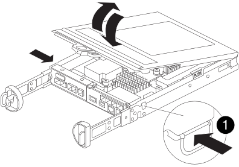

= Replace the boot media - FAS2820
:icons: font
:imagesdir: ../media/

[.lead]
You must remove and open the impaired controller module, locate and replace the boot media in the controller, transfer the boot image to a USB drive, insert the USB drive in the controller, and then boot the controller.

If your storage system is running ONTAP 9.17.1 or later, use the automated boot recovery procedure. If your system is running an earlier version of ONTAP, you must use the manual boot recovery process.

== Step 1: Remove the controller module

.Steps

To access components inside the controller, you must first remove the controller module from the system and then remove the cover on the controller module.

. If you are not already grounded, properly ground yourself.
. Loosen the hook and loop strap binding the cables to the cable management device, and then unplug the system cables and SFPs (if needed) from the controller module, keeping track of where the cables were connected.

. Squeeze the latch on the cam handle until it releases, open the cam handle fully to release the controller module from the midplane, and then, using two hands, pull the controller module out of the chassis.
+
image::../media/drw_2850_pcm_remove_install_IEOPS-694.svg[Remove the controller]

. Turn the controller module over and place it on a flat, stable surface.
. Open the cover by pressing the blue buttons on the sides of the controller module to release the cover, and then rotate the cover up and off of the controller module.

+

[cols="1,2"]
|===

a|
image::../media/icon_round_1.png[Callout number 1]
a|
Controller module cover release button

|===

== Step 2: Replace the boot media

Locate the boot media in the controller module, located under the mezzanine card and follow the directions to replace it.

image:../media/drw_2850_replace_boot_media_IEOPS-696.svg[Replace the boot media]

[cols="1,2"]
|===

a|
image::../media/icon_round_1.png[Callout number 1]
a|
Boot media locking tab

|===

.Steps

. If you are not already grounded, properly ground yourself.
. Remove the mezzanine card using the following illustration or the FRU map on the controller module:
.. Remove the IO Plate by sliding it straight out from thr controller module.
.. Loosen the thumbscrews on the mezzanine card.  
+

NOTE: You can loosen the thumbscrews with your fingers or a screwdriver. If you use your fingers, you might need to rotate the NV battery up for better finger purchase on the thumbscrew next to it.

+
.. Lift the mezzanine card straight up.  

. Replace the boot media: 
.. Press the blue button on the boot media housing to release the boot media from its housing, rotate the boot media up, and then gently pull it straight out of the boot media socket.
+
NOTE: Do not twist or pull the boot media straight up, because this could damage the socket or the boot media.

.. Align the edges of the replacement boot media with the boot media socket, and then gently push it into the socket.
Check the boot media to make sure that it is seated squarely and completely in the socket, and if necessary, remove the boot media and reseat it into the socket.

.. Push the blue locking button, rotate the boot media all the way down, and then release the locking button to lock the boot media in place.
. Reinstall the mezzanine card: 
.. Align the socket on the motherboard with the socket on the mezzanine card, and then gently seat the card in the socket.
.. Tighten the three thumbscrews on the mezzanine card.
.. Reinstall the IO Plate.
. Reinstall the controller module cover and lock it into place.

== Step 3: Transfer the boot image to the boot media

Install the system image on the replacement boot media using a USB flash drive with the image installed on it. You must restore the var file system during this procedure.

.Before you begin
* You must have a USB flash drive, formatted to MBR/FAT32, with at least 4GB capacity.
* You must have a network connection.

.Steps
. Download the appropriate image version of ONTAP to the formatted USB flash drive:
.. Use https://kb.netapp.com/onprem/ontap/dm/Encryption/How_to_determine_if_the_running_ONTAP_version_supports_NetApp_Volume_Encryption_(NVE)[How to determine if the running ONTAP version supports NetApp Volume Encryption (NVE)^] to determine if volume encryption is currently supported.
** If NVE is supported on the cluster, download the image with NetApp Volume Encryption.
** If NVE is not supported on the cluster, download the image without NetApp Volume Encryption.
See https://kb.netapp.com/onprem/ontap/os/Which_ONTAP_image_should_I_download%3F_With_or_without_Volume_Encryption%3F[Which ONTAP image should I download? With or without Volume Encryption?^] for more details.
. Remove the USB flash drive from your laptop.
. Install the controller module:
.. Align the end of the controller module with the opening in the chassis, and then gently push the controller module halfway into the system.
.. Recable the controller module.
+
When recabling, remember to reinstall the media converters (SFPs) if they were removed.

. Insert the USB flash drive into the USB slot on the controller module.
+
Make sure that you install the USB flash drive in the slot labeled for USB devices, and not in the USB console port.

. Push the controller module all the way into the system, making sure that the cam handle clears the USB flash drive, firmly push the cam handle to finish seating the controller module, push the cam handle to the closed position, and then tighten the thumbscrew. 
+
The controller begins to boot as soon as it is completely installed into the chassis and stops at the LOADER prompt. 

.What's next?
After replacing the boot media, you need to link:bootmedia-recovery-image-boot.html[boot the recovery image].
