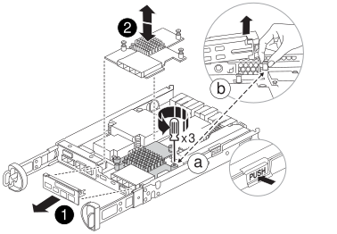

= Replace a mezzanine card - FAS2820
:icons: font
:imagesdir: ../media/

[.lead]
Replace the mezzanine card in your FAS2820 system if the card fails or upgrade it to a different protocol by installing a new card.

* Use this procedure with any ONTAP version supported by your system.
* Replace the mezzanine card with the same type or a different type.
* Write down the ifgrp and VLAN information before shutting down the controller.
* If changing mezzanine card types, change LIF and port settings after the controller restarts.
* Verify that all other system components are working. If the issue persists, call technical support.

video::a8ec891d-f6f6-4479-9ca2-af47017254ff[panopto, title="Animation - Replace the mezzanine card"]

== Step 1: Shut down the impaired controller

.Before you begin
* If you are changing mezzanine card types, capture the target node’s ifgrp and VLAN information.

+
[source,cli]
----
network port vlan show -node _impaired_node_name_
network port ifgrp show -node _impaired_node_name_
----

include::../_include/shutdown_no_mcc.adoc[]

== Step 2: Remove the controller module

Remove the controller module and its cover.

.Steps
. If you are not already grounded, properly ground yourself.

. Loosen the hook and loop strap, note where the cables are connected, and then unplug the system cables and SFPs (if needed).
+
Leave the cables in the cable management device to keep them organized.

. Remove and set aside the cable management devices from the left and right sides of the controller module.
+
. Release the cam handle latch, open it fully, and pull the controller module out of the chassis.
+
image::../media/drw_2850_pcm_remove_install_IEOPS-694.svg[Remove the controller]

. Turn the controller over and place it on a flat, stable surface.
. Press the blue buttons on the sides of the controller module to release the cover. Rotate the cover up and off the controller module.
+

image::../media/drw_2850_open_controller_module_cover_IEOPS-695.svg[Open the controller]

[cols="1,3"]
|===

a|
image::../media/icon_round_1.png[Callout number 1]
a|
Controller module cover release button

|===

== Step 3: Replace the mezzanine card

Replace the mezzanine card.

. If you are not already grounded, properly ground yourself.
. Remove the mezzanine card using the following illustration or the FRU map on the controller module:
+

+
[cols="1,3"]
|===

a|
image::../media/icon_round_1.png[Callout number 1]
a|
I/O Plate
a|
image::../media/icon_round_2.png[Callout number 2]
a|
PCIe mezzanine card

|===

.. Remove the I/O Plate by sliding it straight out from the controller module.
.. Loosen the thumbscrews on the mezzanine card and lift the mezzanine card straight up.
+
NOTE: You can loosen the thumbscrews with your fingers or a screwdriver. If you use your fingers, you might need to rotate the NV battery up for better finger purchase on the thumbscrew next to it.
+
. Reinstall the mezzanine card:
.. Align the connector on the replacement mezzanine card with the socket on the motherboard, and then gently seat the card squarely in the socket.
.. Tighten the three thumbscrews on the mezzanine card.
.. Reinstall the I/O Plate.
. Put the controller module cover back on and lock it.

== Step 4: Install and reboot the controller module

Reinstall and reboot the controller module.

.Steps
. If you are not already grounded, properly ground yourself.
. Turn the controller module over and align the end with the opening in the chassis.
. Gently push the controller module halfway into the chassis.
+
NOTE: Do not completely insert the controller module in the chassis until instructed to do so.

. Reconnect the system cables as needed.
+
If you removed the media converters (QSFPs or SFPs), remember to reinstall them if you are using fiber optic cables.

. Complete the reinstallation of the controller module:
.. With the cam handle open, firmly push the controller module in until fully seated. Close the cam handle to lock.
+
NOTE: Do not use excessive force when sliding the controller module into the chassis to avoid damaging the connectors.
+
The system boots the controller as soon as you seat it in the chassis.

.. If you have not already done so, reinstall the cable management device.
.. Bind the cables to the cable management device with the hook and loop strap.
== Step 5: Reconfigure the mezzanine card (if type changed)

After the controller restarts, change the mezzanine card settings to match the new card if you replaced it with a different type.

[role="tabbed-block"]
====

.Option 1: Fibre Channel to Ethernet mezzanine card
--

Configure the Ethernet replacement mezzanine card by updating LIFs and port settings as needed.

.Steps

. Use the `network port show` command to confirm new port names and link states.
. Rebuild any ifgrps and VLANs on the new Ethernet mezzanine ports.
. Put the new ports, or ifgrp/VLAN ports, in the correct broadcast domains and IPspaces, and set MTU values.
. Update affected LIF home port and failover settings.
. Delete LIFs that are no longer needed.

See link:https://docs.netapp.com/us-en/ontap/networking/configure_network_ports_cluster_administrators_only_overview.html[Learn about ONTAP network port configuration] for more detailed information about configuring Ethernet in ONTAP.

--
.Option 2: Ethernet to Fibre Channel mezzanine card
--
Configure the replacement FC mezzanine card by updating LIFs and port settings as needed.

.Steps

. Enable FCP on relevant SVMs. Create new data LIFs.
. Update fabric zoning and host paths. Update portset, igroup, and LUN mappings as needed.
. Verify host multipath. Confirm there are no stale paths and that paths are balanced between optimized and non-optimized paths.
. Verify no LIFs are homed on removed Ethernet ports, all FC LIFs are up and serving I/O, and AutoSupport monitoring reflects the new configuration.

See link:https://docs.netapp.com/us-en/ontap/san-admin/index.html[SAN management overview] for more detailed information about configuring Fibre Channel in ONTAP.

--

====

== Step 6: Return the controller to normal operation

Give back storage to the impaired controller, restore automatic giveback, and end the AutoSupport maintenance window.

. From the healthy controller or a cluster admin prompt, bring the controller back to normal operation by restoring its storage: `storage failover giveback -ofnode _impaired_node_name_`

. Restore automatic giveback by using the `storage failover modify -node local -auto-giveback true` command.

. If an AutoSupport maintenance window was triggered, end it by using the `system node autosupport invoke -node * -type all -message MAINT=END` command.

== Step 7: Return the failed part to NetApp

include::../_include/complete_rma.adoc[]
