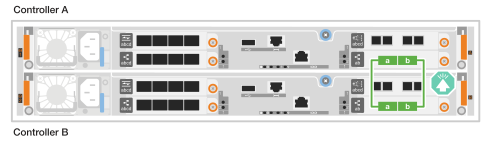
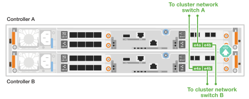
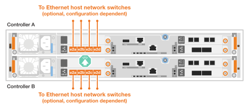
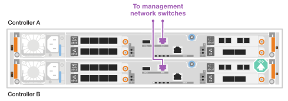
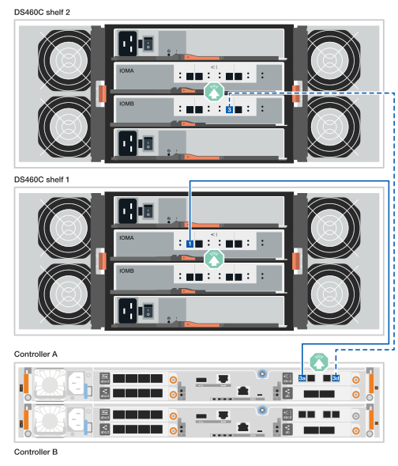

= Cable your FAS50 hardware for network and storage connectivity
:icons: font
:imagesdir: ../media/

[.lead]
After you install your FAS50 storage system hardware, cable the controllers to the network and shelves.

.Before you begin

Contact your network administrator for information about connecting the storage system to your network switches.

.About this task

* The cabling graphics have arrow icons showing the proper orientation (up or down) of the cable connector pull-tab when inserting a connector into a port.
+
As you insert the connector, you should feel it click into place; if you do not feel it click, remove it, turn it over and try again.
+
image:../media/drw_cable_pull_tab_direction_ieops-1699.svg[Cable pull tab direction]

* If cabling to an optical switch, insert the optical transceiver into the controller port before cabling to the switch port.

== Step 1: Cable the cluster/HA connections
Create the ONTAP cluster connections. For switchless clusters, connect the controllers to each other. For switched clusters, connect the controllers to the cluster network switches.

[NOTE]
====
The cluster/HA cabling examples show common configurations. 

If you do not see your configuration here, go to link:https://hwu.netapp.com[NetApp Hardware Universe^] for comprehensive configuration and slot priority information to cable your storage system.
====

[role="tabbed-block"]
====
.Switchless cluster cabling
--
Use this cabling option when the two controllers are directly connected to each other without using cluster network switches.

.FAS50 with one 2-port 40/100 GbE I/O module
Cable the cluster/HA interconnect ports on the I/O module in slot 4.

NOTE: The cluster interconnect traffic and the HA traffic share the same physical ports (on the I/O module in slot 4). The ports are 40/100 GbE.

.Steps

. Cable controller A port e4a to controller B port e4a.
. Cable controller A port e4b to controller B port e4b.

*100 GbE Cluster/HA interconnect cables*

image::../media/oie_cable100_gbe_qsfp28.png[Cluster HA 100 GbE cable, width=100px]

--

.Switched cluster cabling
--
Use this cabling option when the controllers connect to cluster network switches instead of being directly connected to each other.

.FAS50 with one 2-port 40/100 GbE I/O module
Cable the cluster/HA interconnect ports on the I/O module in slot 4 to the cluster network switches.

NOTE: The cluster interconnect traffic and the HA traffic share the same physical ports (on the I/O module in slot 4). The ports are 40/100 GbE.

.Steps
. Cable controller A port e4a to cluster network switch A. 
. Cable controller A port e4b to cluster network switch B.
. Cable controller B port e4a to cluster network switch A. 
. Cable controller B port e4b to cluster network switch B.
+
*40/100 GbE Cluster/HA interconnect cables*
+
image::../media/oie_cable100_gbe_qsfp28.png[Cluster HA 40/100 GbE cable, width=100px]
+

--
====

== Step 2: Cable the host network connections
Cable the controllers to your Ethernet or FC host network.

[NOTE]
====
The host network cabling examples show common configurations. 

If you do not see your configuration here, go to link:https://hwu.netapp.com[NetApp Hardware Universe^] for comprehensive configuration and slot priority information to cable your storage system.
====

[role="tabbed-block"]
====
.Ethernet host cabling
--
Connect the controllers to your Ethernet host network using the appropriate ports based on your I/O module configuration.

.FAS50 with one 4-port 10/25 GbE I/O module
On each controller, cable ports e2a, e2b, e2c and e2d to the Ethernet host network switches.

*10/25 GbE cables*

image:../media/oie_cable_sfp_gbe_copper.png[GbE SFP copper connector, width=100px]

--

.FC host cabling
--
Connect the controllers to your Fibre Channel host network using the FC I/O module in your system.

.FAS50 with one 4-port 64 Gb/s FC I/O module
On each controller, cable ports 2a, 2b, 2c and 2d to the FC host network switches.

*64 Gb/s FC cables*

image:../media/oie_cable_sfp_gbe_copper.png[64 Gb fc cable,width=100px]

image::../media/drw_isi_fas50_4p_64gb_fc_optional_cabling_ieops-1935.svg[Cable to 64gb fc host network switches]
--
====

== Step 3: Cable the management network connections
Cable the management (wrench) ports on each controller to the management network switches.

*1000BASE-T RJ-45 cables*

image::../media/oie_cable_rj45.png[RJ-45 cables]

IMPORTANT: Do not plug in the power cords yet. 

== Step 4: Cable the shelf connections
The following procedures show how to cable the controllers to one or two DS460C shelves.

.About this task

* The cabling examples show DS460C shelves; however, additional SAS shelves are supported, see link:https://hwu.netapp.com[NetApp Hardware Universe^].
+
Cabling for other supported SAS shelves is similar. See link:../sas3/install-new-system.html[Install and cable shelves for a new system installation^]. You can also refer to link:../sas3/overview-cabling-rules-examples.html[SAS cabling rues, worksheets, and examples overview^].

* For the maximum number of shelves supported for your storage system and all of your cabling options, such as optical and switch-attached, see link:https://hwu.netapp.com[NetApp Hardware Universe^].

* The graphics show controller A cabling in blue and controller B cabling in yellow.

* You use the storage cables that came with your storage system, which could be the following cable type:
+
*mini-SAS HD cable*
+
image::../media/oie_cable_mini_sas_hd_to_mini_sas_hd.svg[mini-SAS HD cable,width=100px]

=== One DS460C shelf

Cable each controller to each IOM12 module on the DS460C shelf.

.Steps

. Cable controller A port 3a to IOMA port 1.
. Cable controller A port 3d to IOMB port 3.
+
image:../media/drw_isi_fas50_1_ds460c_controller_a_cabling_ieops-2167.svg[Controller A ports 3a and 3d cabled to one DS460C shelf]

. Cable controller B port 3a to IOMB port 1.
. Cable controller B port 3d to IOMA port 3.
+
image:../media/drw_isi_fas50_1_ds460c_controller_b_cabling_ieops-2169.svg[Controller B ports 3a and 3d cabled to one DS460C shelf]

=== Two DS460C shelves

Connect each controller to the IOM12 modules on both DS460C shelves.

. Cable Shelf 1 IOMA port 3 to Shelf 2 IOMA port 1.
. Cable Shelf 1 IOMB port 3 to Shelf 2 IOMB port 1.
+
image:../media/drw_isi_fas50_2_ds460c_shelf_to_shelf_ieops-2172.svg[cable shelf to shelf connections]

. Cable controller A port 3a to shelf 1 IOMA port 1.
. Cable controller A port 3d to shelf 2 IOMB port 3.
+

. Cable controller B port 3a to shelf 1 IOMB port 1.
. Cable controller B port 3d to shelf 2 IOMA port 3.
+
image:../media/drw_isi_fas50_2_ds460c_controller_b_cabling_ieops-2171.svg[Controller B ports 3a and 3d cabled to two DS460C shelves] 

.What's next?

After you’ve cabled the hardware for your storage system, you link:install-power-hardware.html[power on the storage system].

