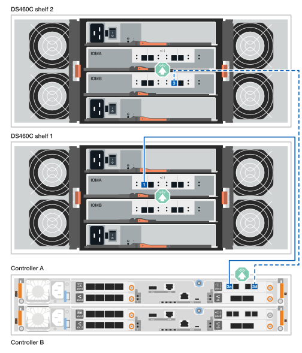

= Cable the hardware - FAS50
:icons: font
:imagesdir: ../media/

[.lead]
After you install your FAS50 storage system hardware, cable the controllers to the network and shelves.

.Before you begin

Contact your network administrator for information about connecting the storage system to your network switches.

.About this task
* The cluster/HA and host network cabling procedures show common configurations. Keep in mind that the specific cabling depends on the components ordered for your storage system. For comprehensive configuration and slot priority details, see link:https://hwu.netapp.com[NetApp Hardware Universe^].

* The cabling graphics have arrow icons showing the proper orientation (up or down) of the cable connector pull-tab when inserting a connector into a port.
+
As you insert the connector, you should feel it click into place; if you do not feel it click, remove it, turn it over and try again.
+
image:../media/drw_cable_pull_tab_direction_ieops-1699.svg[Cable pull tab direction]

* If cabling to an optical switch, insert the optical transceiver into the controller port before cabling to the switch port.

== Step 1: Cable the cluster/HA connections
Cable the controllers to create the ONTAP cluster connections.

//open tabbed block 
[role="tabbed-block"]
=====
.Switchless cluster cabling
--

//.FAS50 with two 2-port 40/100 GbE I/O modules
//[%collapsible]
//====

//.Steps

//. Cable the Cluster/HA interconnect connections: 
//+
//NOTE: The cluster interconnect traffic and the HA traffic share the same physical ports (on the I/O modules in slots 2 and 4). The ports are 40/100 GbE. 
//+
//.. Cable controller A port e2a to controller B port e2a.
//.. Cable controller A port e4a to controller B port e4a.
//+
//NOTE: I/O module ports e2b and e4b are unused and available for host network connectivity.
//+
//*100 GbE Cluster/HA interconnect cables*
//+
//image::../media/oie_cable100_gbe_qsfp28.png[Cluster HA 100 GbE cable, width=100pxx]
//+
//image::../media/drw_isi_a30-50_switchless_2p_100gbe_2card_cabling_ieops-2011.svg[a30 and a50 switchless cluster cabling diagram using two 100gbe io modules]
//+

//image::../media/drw_isi_fas50_switchless_2p_100gbe_cabling_ieops-1937.svg[fas50 switchless cluster cabling diagram using one 100gbe io modules]

//====

.FAS50 with one 2-port 40/100 GbE I/O module
[%collapsible]

====

.Steps

. Cable the Cluster/HA interconnect connections: 
+
NOTE: The cluster interconnect traffic and the HA traffic share the same physical ports (on the I/O module in slot 4). The ports are 40/100 GbE.
+
.. Cable controller A port e4a to controller B port e4a.
.. Cable controller A port e4b to controller B port e4b.
+
*100 GbE Cluster/HA interconnect cables*
+
image::../media/oie_cable100_gbe_qsfp28.png[Cluster HA 100 GbE cable, width=100pxx]
//+
//image::../media/drw_isi_a30-50_switchless_2p_100gbe_1card_cabling_ieops-1925.svg[a30 and a50 switchless cluster cabling diagram using one 100gbe io module]
+
image::../media/drw_isi_fas50_switchless_2p_100gbe_cabling_ieops-1937.svg[fas50 switchless cluster cabling diagram using one 100gbe io module]

====

//.FAS50 with one 2-port 10/25 GbE I/O module
//[%collapsible]

//====

//.Steps
//. Cable the Cluster/HA interconnect connections: 
//+
//NOTE: The cluster interconnect traffic and the HA traffic share the same physical ports (on the I/O module in slot 4). The ports are 10/25 GbE.
//+
//.. Cable controller A port e4a to controller B port e4a.
//.. Cable controller A port e4b to controller B port e4b.
//+
//*25 GbE Cluster/HA interconnect cables*
//+
//image:../media/oie_cable_sfp_gbe_copper.png[GbE SFP copper connector, width=100px]
//+
//image::../media/drw_isi_a20_switchless_2p_25gbe_cabling_ieops-2018.svg[a20 switchless cluster cabling diagram using one 25 gbe io module]

//====

--
.Switched cluster cabling
--

//.AFF A30 or AFF A50 with two 2-port 40/100 GbE I/O modules
//[%collapsible]

//====

//.Steps

//. Cable the Cluster/HA interconnect connections: 
//+
//NOTE: The cluster interconnect traffic and the HA traffic share the same physical ports (on the I/O modules in slots 2 and 4). The ports are 40/100 GbE.
//+
//.. Cable controller A port e4a to cluster network switch A.
//.. Cable controller A port e2a to cluster network switch B.
//.. Cable controller B port e4a to cluster network switch A.
//.. Cable controller B port e2a to cluster network switch B.
//+
//NOTE: I/O module ports e2b and e4b are unused and available for host network connectivity.
//+
//*40/100 GbE Cluster/HA interconnect cables*
//+
//image::../media/oie_cable100_gbe_qsfp28.png[Cluster HA 40/100 GbE cable, width=100px]
//+
//image::../media/drw_isi_a30-50_switched_2p_100gbe_2card_cabling_ieops-2013.svg[a30 and a50 switched cluster cabling diagram using two 100gbe io modules]

//====

//.AFF A30 or AFF A50 with one 2-port 40/100 GbE I/O module
[%collapsible]

//====

//.Steps

//. Cable the controllers to the cluster network switches:
//+
//NOTE: The cluster interconnect traffic and the HA traffic share the same physical ports (on the I/O module in slot 4). The ports are 40/100 GbE.
//+
//.. Cable controller A port e4a to cluster network switch A. 
//.. Cable controller A port e4b to cluster network switch B.
//.. Cable controller B port e4a to cluster network switch A. 
//.. Cable controller B port e4b to cluster network switch B.
//+
//*40/100 GbE Cluster/HA interconnect cables*
//+
//image::../media/oie_cable100_gbe_qsfp28.png[Cluster HA 40/100 GbE cable, width=100px]
//+
//image::../media/drw_isi_a30-50_2p_100gbe_1card_switched_cabling_ieops-1926.svg[Cable cluster connections to cluster network,width=500px]

//====

.FAS50 with one 2-port 40/100 GbE I/O module
[%collapsible]
====

. Cable the controllers to the cluster network switches:
+
NOTE: The cluster interconnect traffic and the HA traffic share the same physical ports(on the I/O module in slot 4). The ports are 40/100 GbE.
+
.. Cable controller A port e4a to cluster network switch A. 
.. Cable controller A port e4b to cluster network switch B.
.. Cable controller B port e4a to cluster network switch A. 
.. Cable controller B port e4b to cluster network switch B.
+
*40/100 GbE Cluster/HA interconnect cables*
+
image::../media/oie_cable100_gbe_qsfp28.png[Cluster HA 40/100 GbE cable, width=100px]
//*10/25 GbE Cluster/HA interconnect cables*
//+
//image:../media/oie_cable_sfp_gbe_copper.png[GbE SFP copper connector, width=100px]
//+
//image:../media/drw_isi_a20_switched_2p_25gbe_cabling_ieops-2019.svg[a20 switched cluster cabling diagram using one 25gbe io module]
+

====
--
=====
//closed tabbed block

== Step 2: Cable the host network connections
Cable the controllers to your Ethernet or FC host network.

//open tabbed block 
[role="tabbed-block"]
=====
.Ethernet host cabling
--

//.AFF A30 or AFF A50 with two 2-port 40/100 GbE I/O modules
//[%collapsible]

//====

//.Steps

//. On each controller, cable ports e2b and e4b to the Ethernet host network switches.
//+
//NOTE: The ports on I/O modules in slot 2 and 4 are 40/100 GbE (host connectivity is 40/100 GbE).
//+
//*40/100 GbE cables*
//+
//image::../media/oie_cable_sfp_gbe_copper.png[40/100 Gb cable, width=100px]
//+
//image::../media/drw_isi_a30-50_host_2p_40-100gbe_2card_cabling_ieops-2014.svg[Cable to 40/100gbe ethernet host network switches]

//====

.FAS50 with one 4-port 10/25 GbE I/O module
[%collapsible]

====

.Steps
. On each controller, cable ports e2a, e2b, e2c and e2d to the Ethernet host network switches.
+
*10/25 GbE cables*
+
image:../media/oie_cable_sfp_gbe_copper.png[GbE SFP copper connector, width=100px]
//+
//image::../media/drw_isi_a30-50_host_2p_40-100gbe_1card_cabling_ieops-1923.svg[Cable to 40/100gbe ethernet host network switches]
+
image::../media/drw_isi_fas50_4p_25gbe_optional_cabling_ieops-1934.svg[cable fas50 to 10/25gbe ethernet host network switches]

====

--
.FC host cabling
--

.FAS50 with one 4-port 64 Gb/s FC I/O module
[%collapsible]

====

.Steps
. On each controller, cable ports 1a, 1b, 1c and 1d  to the FC host network switches.
+
*64 Gb/s FC cables*
+
image:../media/oie_cable_sfp_gbe_copper.png[64 Gb fc cable,width=100px]
//+
//image::../media/drw_isi_a30-50_4p_64gb_fc_1card_cabling_ieops-1924.svg[Cable to 64gb fc host network switches]
+
image::../media/drw_isi_fas50_4p_64gb_fc_optional_cabling_ieops-1935.svg[Cable to 64gb fc host network switches]

====
--
=====
//closed tabbed block

== Step 3: Cable the management network connections
Cable the controllers to your management network.

. Cable the management (wrench) ports on each controller to the management network switches.
+
*1000BASE-T RJ-45 cables*
+
image::../media/oie_cable_rj45.png[RJ-45 cables]
+
image::../media/drw_isi_fas50_wrench_cabling_ieops-1938.svg[Connect to your management network]

// [Connect to your management network,width=500px] or xx

IMPORTANT: Do not plug in the power cords yet. 

== Step 4: Cable the shelf connections
The following procedures show how to cable the controllers to a storage system with one or two DS460C shelves.

.About this task

* For the maximum number of shelves supported for your storage system and all of your cabling options, such as optical and switch-attached, see link:https://hwu.netapp.com[NetApp Hardware Universe^].

* The cabling examples show DS460C shelves; however, additional SAS shelves are supported, see link:https://hwu.netapp.com[NetApp Hardware Universe^].
+
Cabling for other supported SAS shelves is similar. See link:../sas3/install-new-system.html[Install and cable shelves for a new system installations^]. You can also refer to link:../sas3/overview-cabling-rules-examples.html[SAS cabling rues, worksheets, and examples overview^].

* The graphics show controller A cabling in blue and controller B cabling in yellow.

* You use the storage cables that came with your storage system, which could be the following cable type:
+
*mini-SAS HD cable*
+
image::../media/oie_cable_mini_sas_hd_to_mini_sas_hd.svg[mini-SAS HD cable,width=100px]

// start tabbed area

[role="tabbed-block"]
====

.Option 1: One DS460C shelf
--
Cable each controller to each IOM12 module on the DS460C shelf. 

.Steps

. Cable controller A to the shelf:
.. Cable controller A port 3a to IOMA port 1.
.. Cable controller A port 3d to IOMB port 3.
+
image:../media/drw_isi_fas50_1_ds460c_controller_a_cabling_ieops-2167.svg[Controller A ports 3a and 3d cabled to one DS460C shelf]

. Cable controller B to the shelf:
.. Cable controller B port 3a to IOMB port 1.
.. Cable controller B port 3d to IOMA port 3.
+
image:../media/drw_isi_fas50_1_ds460c_controller_b_cabling_ieops-2169.svg[Controller B ports 3a and 3d cabled to one DS460C shelf]

// Below commented out should be removed unless Andris/Lueth want another cabling option shown, then need to update.
//--

//.Option 2 test: Two NS224 storage shelves
//--
//Cable each controller to the NSM modules on both NS224 shelves.

//*100 GbE QSFP28 copper cables*

//image::../media/oie_cable100_gbe_qsfp28.png[100 GbE QSFP28 copper cable,width=100px]

//.Steps

//. Cable controller A to the shelf:
//.. Cable controller A port 3a to IOMA port 1.
//.. Cable controller A port 3d to IOMB port 3.
//+
//image:../media/drw_isi_fas50_1_ds460c_controller_a_cabling_ieops-2167.svg[Controller A ports 3a and 3d cabled to one DS460C shelf]

//. Cable controller B to the shelf:
//.. Cable controller B port 3a to IOMB port 1.
//.. Cable controller B port 3d to IOMA port 3.
//+
//image:../media/drw_isi_fas50_1_ds460c_controller_b_cabling_ieops-2169.svg[Controller B ports 3a and 3d cabled to one DS460C shelf]
//+

--
.Option 2: Two DS460C shelves
--
Connect each controller to the IOM12 modules on both DS460C shelves.

. Cable the shelf-to-shelf connections:
.. Cable Shelf 1 IOMA port 3 to Shelf 2 IOMA port 1.
.. Cable Shelf 1 IOMB port 3 to Shelf 2 IOMB port 1.
+

. Cable controller A to the shelves:
.. Cable controller A port 3a to shelf 1 IOMA port 1.
.. Cable controller A port 3d to shelf 2 IOMB port 3.
+

. Cable controller B to the shelves:
.. Cable controller B port 3a to shelf 1 IOMB port 1.
.. Cable controller B port 3d to shelf 2 IOMA port 3.
+
image:../media/drw_isi_fas50_2_ds460c_controller_b_cabling_ieops-2171.svg[Controller B ports 3a and 3d cabled to two DS460C shelves]

--

====

// end tabbed area 

// Remove lines 406 - 442 if Andris and Lueth are okay with the tabbled options above!!!!!!!!!!!!!!!!!!!!!
//
//
//
//
//=== Cable the FAS50 to one DS460C shelf

//.Steps

//. Cable controller A to the shelf:
//.. Cable controller A port 3a to IOMA port 1.
//.. Cable controller A port 3d to IOMB port 3.
//+
//image:../media/drw_isi_fas50_1_ds460c_controller_a_cabling_ieops-2167.svg[Controller A ports 3a and 3d cabled to one DS460C shelf]

//. Cable controller B to the shelf:
//.. Cable controller B port 3a to IOMB port 1.
//.. Cable controller B port 3d to IOMA port 3.
//+
//image:../media/drw_isi_fas50_1_ds460c_controller_b_cabling_ieops-2169.svg[Controller B ports 3a and 3d cabled to one DS460C shelf]

//=== Cable the FAS50 to two DS460C shelves

//.Steps

//. Cable the shelf-to-shelf connections:
//.. Cable Shelf 1 IOMA port 3 to Shelf 2 IOMA port 1.
//.. Cable Shelf 1 IOMB port 3 to Shelf 2 IOMB port 1.
//+
//

//. Cable controller A to the shelves:
//.. Cable controller A port 3a to shelf 1 IOMA port 1.
//.. Cable controller A port 3d to shelf 2 IOMB port 3.
//+
//

//. Cable controller B to the shelves:
//.. Cable controller B port 3a to shelf 1 IOMB port 1.
//.. Cable controller B port 3d to shelf 2 IOMA port 3.
//+
//image:../media/drw_isi_fas50_2_ds460c_controller_b_cabling_ieops-2171.svg[Controller B ports 3a and 3d cabled to two DS460C shelves]

.What's next?

After you’ve cabled the hardware for your storage system, you link:install-power-hardware.html[power on the storage system].

