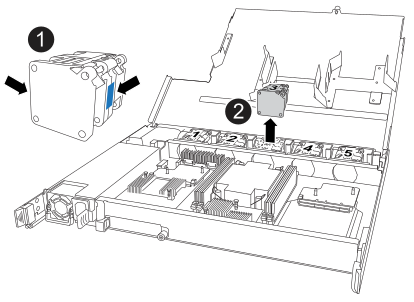

= Replace a fan module - NS224 shelves
:icons: font
:imagesdir: ../media/

[.lead]
You can replace a failed fan module nondisruptively in an NS224 drive shelf that is powered on, and while I/O is in progress.

.Before you begin

* The shelf's partner NSM must be up and running, and be cabled correctly so that your shelf maintains connectivity when you remove the NSM with the failed FRU (target NSM).
+
https://mysupport.netapp.com/site/tools/tool-eula/activeiq-configadvisor[NetApp Downloads: Config Advisor^]

* All other components in the system, including the other four fans, must be functioning properly.

.About this task

* Allow at least 70 seconds between removal and installation of the NVMe shelf module (NSM).
+
This allows enough time for ONTAP to process the NSM removal event.

* *Best practice:* The best practice is to have current versions of NVMe shelf module (NSM) firmware and drive firmware on your system before replacing FRU components.
+
https://mysupport.netapp.com/site/downloads/firmware/disk-shelf-firmware[NetApp Downloads: Disk Shelf Firmware^]
+
https://mysupport.netapp.com/site/downloads/firmware/disk-drive-firmware[NetApp Downloads: Disk Drive Firmware^]
+
[NOTE]
====
Do not revert firmware to a version that does not support your shelf and its components.

====
* If needed, you can turn on the shelf's location (blue) LEDs to aid in physically locating the affected shelf: `storage shelf location-led modify -shelf-name _shelf_name_ -led-status on`
+
If you do not know the `_shelf_name_` of the affected shelf, run the `storage shelf show` command.
+
A shelf has three location LEDs: one on the operator display panel and one on each NSM. Location LEDs remain illuminated for 30 minutes. You can turn them off by entering the same command, but using the `off` option.

* When you unpack the replacement fan, save all packing materials for use when you return the failed fan.
+
If you need the RMA number or additional help with the replacement procedure, contact technical support at https://mysupport.netapp.com/site/global/dashboard[NetApp Support^], 888-463-8277 (North America), 00-800-44-638277 (Europe), or +800-800-80-800 (Asia/Pacific).

[role="tabbed-block"]
====

.NSM100 modules
--
You can use the following animation to assist in replacing a fan in an NS224 with NSM100 modules.

video::29635ff8-ae86-4a48-ab2a-aa86002f3b66[panopto, title="Replace a fan in an NS224 shelf"]

.Steps

. Properly ground yourself.
. Disconnect the cabling from the NSM that contains the FRU that you are replacing:
 .. Disconnect the power cord from the power supply by opening the power cord retainer if it is an AC power supply, or unscrewing the two thumb screws if it is a DC power supply, and then unplug the power cord from the power supply.
+
Power supplies do not have a power switch.

 .. Disconnect the storage cabling from the NSM ports.
+
Make a note of the NSM ports that each cable is connected to. You reconnect the cables to the same ports when you reinsert the NSM later in this procedure.
. Remove the NSM from the shelf:
 .. Loop your index fingers through the finger holes of the latching mechanisms on either side of the NSM.
+
NOTE: If you are removing the bottom NSM, and if the bottom rail is obstructing access to the latching mechanisms, place your index fingers through the finger holes from the inside (by crossing your arms).

 .. With your thumbs, press down and hold the orange tabs on top of the latching mechanisms.
+
The latching mechanisms raise, clearing the latching pins on the shelf.

 .. Gently pull until the NSM is about one third of the way out of the shelf, grasp the NSM sides with both hands to support its weight, and then place it on a flat stable surface.
+
When you begin pulling, the latching mechanism arms extend from the NSM and lock in their fully extended position.
. Loosen the NSM cover thumb screw and open the cover.
+
NOTE: The FRU label on the NSM cover shows the location of the five fans, along the rear wall of the NSM.

. Physically identify the failed fan.
+
When a fan fails, the system logs a warning message to the system console indicating which fan failed.
//05Oct2022, Racer5: removed text describing location of onboard attention LED.
. Replace the failed fan:
 .. Remove the failed fan by firmly grasping the sides, where the blue touch points are located, and then lift it vertically to disconnect it from the socket.
 .. Insert the replacement fan by aligning it within the guides, and then push down until the fan module connector is fully seated in the socket.
. Close the NSM cover, and then tighten the thumb screw.
. Reinsert the NSM into the shelf:
 .. Make sure that the latching mechanism arms are locked in the fully extended position.
 .. Using both hands, gently slide the NSM into the shelf until the weight of the NSM is fully supported by the shelf.
 .. Push the NSM into the shelf until it stops (about half an inch from the back of the shelf).
+
You can place your thumbs on the orange tabs on the front of each finger loop (of the latching mechanism arms) to push in the NSM.

 .. Loop your index fingers through the finger holes of the latching mechanisms on either side of the NSM.
+
NOTE: If you are inserting the bottom NSM, and if the bottom rail is obstructing access to the latching mechanisms, place your index fingers through the finger holes from the inside (by crossing your arms).

 .. With your thumbs, press down and hold the orange tabs on top of the latching mechanisms.
 .. Gently push forward to get the latches over the stop.
 .. Release your thumbs from the tops of the latching mechanisms, and then continue pushing until the latching mechanisms snap into place.
+
The NSM should be fully inserted into the shelf and flush with the edges of the shelf.
. Reconnect the cabling to the NSM:
 .. Reconnect the storage cabling to the same two NSM ports.
+
Cables are inserted with the connector pull-tab facing up. When a cable is inserted correctly, it clicks into place.

 .. Reconnect the power cord to the power supply, and then secure the power cord with the power cord retainer if it is an AC power supply, or tighten the two thumb screws if it is a DC power supply, and then unplug the power cord from the power supply.
+
When functioning correctly, a power supply's bicolored LED illuminates green.
+
Additionally, both NSM port LNK (green) LEDs illuminate. If a LNK LED does not illuminate, reseat the cable.
. Verify that the attention (amber) LEDs on the NSM containing the failed fan and the shelf operator display panel are no longer illuminated.
+
The NSM attention LEDs turn off after the NSM reboots and no longer detects a fan issue. This can take three to five minutes.

. Verify that the NSM is cabled correctly, by running Active IQ Config Advisor.
+
If any cabling errors are generated, follow the corrective actions provided.
+
https://mysupport.netapp.com/site/tools/tool-eula/activeiq-configadvisor[NetApp Downloads: Config Advisor^]

--

.NSM100B modules
--

.Steps

. Properly ground yourself.
. Disconnect the cabling from the NSM that contains the FRU that you are replacing:
 .. Disconnect the power cord from the power supply by opening the power cord retainer if it is an AC power supply, or unscrewing the two thumb screws if it is a DC power supply, and then unplug the power cord from the power supply.
+
Power supplies do not have a power switch.

 .. Disconnect the storage cabling from the NSM ports.
+
Make a note of the NSM ports that each cable is connected to. You reconnect the cables to the same ports when you reinsert the NSM later in this procedure.

include::../_include/t_module_remove.adoc[]

. Open the NSM cover by turning the thumbscrew counterclockwise to loosen, and then open the cover.
+
NOTE: The FRU label on the NSM cover shows the location of the five fans, along the rear wall of the NSM.

. Physically identify the failed fan.
+
When a fan fails, the system logs a warning message to the system console indicating which fan failed.
//05Oct2022, Racer5: removed text describing location of onboard attention LED.
. Replace the failed fan:
+

 .. Remove the failed fan by firmly grasping the sides where the blue touch points are located, and then pull it straight up out of its socket.
 .. Insert the replacement fan by aligning it within the guides, and then push down until the fan connector is fully seated in the socket.
. Close the NSM cover, and then tighten the thumb screw.

include::../_include/t_module_reinstall.adoc[]

. Reconnect the cabling to the NSM:
 .. Reconnect the storage cabling to the same two NSM ports.
+
Cables are inserted with the connector pull-tab facing up. When a cable is inserted correctly, it clicks into place.

 .. Reconnect the power cord to the power supply, and then secure the power cord with the power cord retainer if it is an AC power supply, or tighten the two thumb screws if it is a DC power supply, and then unplug the power cord from the power supply.
+
When functioning correctly, a power supply's bicolored LED illuminates green.
+
Additionally, both NSM port LNK (green) LEDs illuminate. If a LNK LED does not illuminate, reseat the cable.
. Verify that the attention (amber) LEDs on the NSM containing the failed fan and the shelf operator display panel are no longer illuminated.
+
The NSM attention LEDs turn off after the NSM reboots and no longer detects a fan issue. This can take three to five minutes.

. Verify that the NSM is cabled correctly, by running Active IQ Config Advisor.
+
If any cabling errors are generated, follow the corrective actions provided.
+
https://mysupport.netapp.com/site/tools/tool-eula/activeiq-configadvisor[NetApp Downloads: Config Advisor^]

--

====