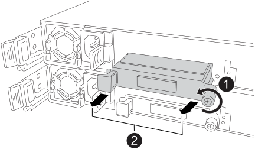

= Replace the Ethernet I/O module - NS224 shelves with NSM100B modules
:icons: font
:imagesdir: ../media/

[.lead]
You can replace a failed Ethernet I/O module nondisruptively in an NS224 drive shelf that is powered on, and while I/O is in progress. This procedure only applies to NS224 shelves with NSM100B modules.

.Before you begin

* The shelf's partner NSM must be up and running, and be cabled correctly so that your shelf maintains connectivity when you remove the failed NSM.
+
https://mysupport.netapp.com/site/tools/tool-eula/activeiq-configadvisor[NetApp Downloads: Config Advisor^]

* All other components in the system must be functioning properly.

.About this task

* Allow at least 70 seconds between removal and installation of the NVMe shelf module (NSM).
+
This allows enough time for ONTAP to process the NSM removal event.

* *Best practice:* The best practice is to have current versions of NVMe shelf module (NSM) firmware and drive firmware on your system before replacing FRU components.
+
https://mysupport.netapp.com/site/downloads/firmware/disk-shelf-firmware[NetApp Downloads: Disk Shelf Firmware^]
+
https://mysupport.netapp.com/site/downloads/firmware/disk-drive-firmware[NetApp Downloads: Disk Drive Firmware^]
+
[NOTE]
====
Do not revert firmware to a version that does not support your shelf and its components.

====
* Shelf (NSM) firmware is automatically updated (nondisruptively) on a new NSM that has a non-current firmware version.
+
NSM firmware checks occur every 10 minutes. An NSM firmware update can take up to 30 minutes.

* If needed, you can turn on the shelf's location (blue) LEDs to aid in physically locating the affected shelf: `storage shelf location-led modify -shelf-name _shelf_name_ -led-status on`
+
If you do not know the `shelf_name` of the affected shelf, run the `storage shelf show` command.
+
A shelf has three location LEDs: one on the operator display panel and one on each NSM. Location LEDs remain illuminated for 30 minutes. You can turn them off by entering the same command, but using the `off` option.

* When you unpack the replacement NSM, save all packing materials for use when you return the failed NSM.
+
If you need the RMA number or additional help with the replacement procedure, contact technical support at https://mysupport.netapp.com/site/global/dashboard[NetApp Support^], 888-463-8277 (North America), 00-800-44-638277 (Europe), or +800-800-80-800 (Asia/Pacific).

.Steps

. Properly ground yourself.
. Disconnect the cabling from the NSM that contains the FRU that you are replacing:
 .. Disconnect the power cord from the power supply by opening the power cord retainer if it is an AC power supply, or unscrewing the two thumb screws if it is a DC power supply, and then unplug the power cord from the power supply.
+
Power supplies do not have a power switch.

 .. Disconnect the storage cabling from the NSM ports.
+
Make a note of the NSM ports that each cable is connected to. You reconnect the cables to the same ports when you reinsert the NSM, later in this procedure.

include::../_include/t_module_remove.adoc[]

. Remove the failed I/O module from the NSM:
+

.. Turn the I/O module thumbscrew counterclockwise to loosen.
.. Pull the I/O module out of the NSM using the port label tab on the left and the thumbscrew.

. Install the replacement I/O module into the target slot:

.. Align the I/O module with the edges of the slot.

.. Gently push the I/O module all the way into the slot, making sure to properly seat the module into the connector.
+
You can use the tab on the left and the thumbscrew to push in the I/O Module.
+
.. Turn the thumbscrew clockwise to tighten.

include::../_include/t_module_reinstall.adoc[]

. Recable the NSM.
.. Reconnect the storage cabling to the same two NSM ports.
+
Cables are inserted with the connector pull-tab facing up. When a cable is inserted correctly, it clicks into place.

.. Reconnect the power cord to the power supply, and then secure the power cord with the power cord retainer if it is an AC power supply, or tighten the two thumb screws if it is a DC power supply, and then unplug the power cord from the power supply.
+
When functioning correctly, a power supply's bicolored LED illuminates green.
+
Additionally, both NSM port LNK (green) LEDs illuminate. If a LNK LED does not illuminate, reseat the cable.

. Verify that the attention (amber) LEDs on the NSM containing the failed I/O module and the shelf operator display panel are no longer illuminated
+
The NSM attention LEDs turn off after the NSM reboots and no longer detects an I/O module issue. This can take three to five minutes.

. Verify that the NSM is cabled correctly, by running Active IQ Config Advisor.
+
If any cabling errors are generated, follow the corrective actions provided.
+
https://mysupport.netapp.com/site/tools/tool-eula/activeiq-configadvisor[NetApp Downloads: Config Advisor^]

