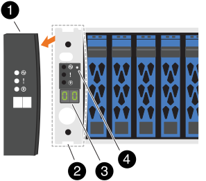
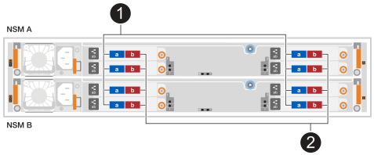

= Hot-add a shelf - NX224 shelves
:icons: font
:imagesdir: ../media/

[.lead]
You can expand your storage capabilities by hot-adding an NX224 shelf to your existing OAM cluster configuration.

.About this task

* After you have cabled a hot-added shelf, ONTAP recognizes the shelf. NSM shelf firmware and drive firmware should be updated automatically, if needed.
+
NOTE: Firmware updates can take up to 30 minutes.

.Before you begin 

* Before hot-adding a shelf, ensure you have:
** A paper clip with one side straightened or a narrow-tipped ballpoint pen.
+
To change the shelf ID, you use the paper clip or ballpoint pen to access the shelf ID button behind the Operator Display Panel (ODP) for the change shelf ID step.

** The correct number and type of cables to connect the shelf. See https://hwu.netapp.com[NetApp Hardware Universe^].

* Understand that a fully loaded NX224 shelf can weigh an average of 56.8 lbs (25.8 kg) and requires two people to lift or use of a hydraulic lift. Avoid removing shelf components (from the front or rear of the shelf) to reduce the shelf weight, because shelf weight will become unbalanced.

* An NX224 shelf contains two NSM140 modules. The top module goes in slot A (NSM A) and the bottom module goes in slot B (NSM B).

* Your platform model and version of ONTAP must support the NX224 shelf and drives you are hot-adding. See https://hwu.netapp.com[NetApp Hardware Universe^]

* Your OAM cluster must have less than the maximum number of shelves supported, by at least the number of shelves you plan to hot-add.
+
You cannot have exceeded the maximum number of shelves supported by your OAM cluster after hot-adding shelves. See https://hwu.netapp.com[NetApp Hardware Universe^].

* *Best practice:* Ensure you have the current version of the https://mysupport.netapp.com/site/downloads/firmware/disk-drive-firmware/download/DISKQUAL/ALL/qual_devices.zip[Disk Qualification Package^] installed before hot-adding a shelf.
+
Having the current version of the DQP installed allows your system to recognize and use newly qualified drives. This avoids system event messages about having noncurrent drive information and prevention of drive partitioning because drives are not recognized. The DQP also notifies you of noncurrent drive firmware.
+
//30 aug 2022, BURT 1491809: correct the DQP link

* *Best practice*: Run https://mysupport.netapp.com/site/tools/tool-eula/activeiq-configadvisor[Active IQ Config Advisor^] before and after hot-adding a shelf to view any storage cabling error messages and the corrective actions you should take.
+
Running Active IQ Config Advisor before hot-adding a shelf provides a snapshot of the existing shelf Ethernet (ENET) connectivity, verifies NVMe shelf module (NSM) firmware versions, and allows you to verify a shelf ID already in use in the OAM cluster.
+
Running Active IQ Config Advisor after hot-adding a shelf allows you to verify shelves are cabled correctly and that shelf IDs are unique within the OAM cluster.

* *Best practice:* Ensure you have current versions of https://mysupport.netapp.com/site/downloads/firmware/disk-shelf-firmware[NVMe shelf module (NSM) firmware^] and https://mysupport.netapp.com/site/downloads/firmware/disk-drive-firmware[drive firmware^] on your storage system before adding a new shelf.
+
NOTE: Do not revert firmware to a version that does not support your shelf and its components.

== Step 1: Install a shelf for a hot-add

You need to install an NX224 shelf in a cabinet or telco rack, connect the power cords (which automatically powers on the shelf), and set the shelf ID.

.Steps

. Install the rail kit for the shelf, as needed, using the instructions included with the kit.
+
NOTE: Always use the appropriate rail kit for your shelf to install the shelf in a rack or cabinet.

. Install the shelf:
+
.. Position the back of the shelf onto the rails, and then support the shelf from the bottom and slide it into the cabinet or telco rack.
+
It is recommended to install all shelves close to the switches. If you do not, you may need to use optical intterconnect cables to connect the shelf to the switches.
+
.. Secure the shelf to the cabinet or telco rack using the mounting screws included in the kit.
+
. Connect the power:
+
.. Connect the power cords to the shelf and secure them in place with the power cord retainers.
.. Connect the power cords to different power sources for resiliency.
+
A shelf powers up when connected to a power source; it does not have power switches. When functioning correctly, a power supply's bicolored LED illuminates green.

. Set the shelf ID to a number that is unique within the OAM cluster:
+
For more detailed instructions, see link:change-shelf-id.html[Change a shelf ID - NX224 shelves^].
+

+

[cols="20%,80%"]
|===
a|
image::../media/icon_round_1.png[Callout number 1] 
a|
Shelf end cap
a|
image::../media/icon_round_2.png[[Callout number 2]
a|
Shelf faceplate 
a|
image::../media/icon_round_3.png[[Callout number 3]
a|
Shelf ID number
a|
image::../media/icon_round_4.png[[Callout number 4]
a|
Shelf ID button access

|===
.. Remove the left end cap and locate the small hole to the right of the LEDs.
.. Insert the end of a paper clip or similar tool into the small hole to reach the shelf ID button.
.. Press and hold the button (for up to 15 seconds) until the first number on the digital display blinks, and then release the button.
+
If the ID takes longer than 15 seconds to blink, press and hold the button again, making sure to press it in all the way.
+
.. Press and release the button to advance the number until you reach the desired number from 0 to 9.
.. Repeat substeps 4c and 4d to set the second number of the shelf ID.
+
It can take up to three seconds (instead of 15 seconds) for the number to blink.

.. Press and hold the button until the second number stops blinking.
+
After about five seconds, both numbers start blinking and the amber LED on the ODP illuminates.

.. Power-cycle the shelf to make the shelf ID take effect.
+
You must unplug both power cords from the shelf, wait 10 seconds, and then plug them back in.
+
When power is restored to the power supplies, their bicolored LEDs illuminate green.

== Step 2: Cable shelf for hot-add

You cable each NX224 shelf you are hot-adding so that each shelf has eight connections to each switch.

.Before you begin

* Familiarize yourself with proper cable connector orientation, and the location and labeling of ports on the NX224 NSM140 shelf modules.

** Cables are inserted with the connector pull-tab facing up.
+
When a cable is inserted correctly, it clicks into place.
+
After you connect both ends of the cable, the shelf and controller port LNK (green) LEDs illuminate. If a port LNK LED does not illuminate, reseat the cable.
+
image::../media/oie_cable_pull_tab_up.png[Cables are inserted with the connector pull tab facing up]

** Each NSM140 module includes 4 x 100GbE CX7 Path_A ports (e1a, e2a, e3a, and e4a) and 4 x 100GbE CX7 Path_B ports (e1b, e2b, e3b, and e4b).
+
The following illustration highlights the Path_A and Path_B ports on the NSM140 modules:
+

+
[cols="1,4"]
|===
a|
image::../media/icon_round_1.png[Callout number 1]
a|
Path_A ports (blue ports)
a|
image::../media/icon_round_2.png[Callout number 2]
a|
Path_B ports (red ports)
|===

.Steps

. Cable shelf NSM A and NSM B Path_A ports e1a, e2a, e3a, and e4a to any port on switch A.
. Cable shelf NSM A and NSM B Path_B ports e1b, e2b, e3b, and e4b to any port on switch B.
+
The following illustration highlights the cabling for hot-adding an additional shelf to a switch configuration. To add additional shelves, follow the same switch-based cabling methodology.
+
image::../media/drw_nx224_afx_a1k_ieops-2344.svg[NX224 switch cabling to AFX A1K]

. Verify that the hot-added shelf is cabled correctly using https://mysupport.netapp.com/site/tools/tool-eula/activeiq-configadvisor[Active IQ Config Advisor^].
+
If any cabling errors are generated, follow the corrective actions provided.