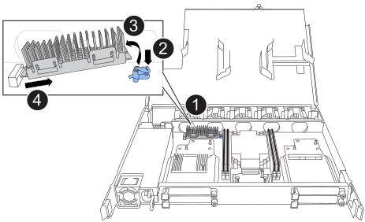

= Replace the boot media - NX224 shelves
:icons: font
:imagesdir: ../media/

[.lead]
You can replace a failed boot media in an NX224 shelf. Replacing the boot media can be done nondisruptively, while the drive shelf is powered on, and I/O is in progress.

.About this task

* After the boot media is replaced, the boot image from the shelf's partner NSM is automatically copied to the replacement boot media.
+
This can take up to five minutes.

* Allow at least 70 seconds between removal and installation of the NVMe shelf module (NSM).
+
This allows enough time for ONTAP to process the NSM removal event. 

* If needed, you can turn on the shelf's location (blue) LEDs to aid in physically locating the affected shelf: `storage shelf location-led modify -shelf-name _shelf_name_ -led-status on`
+
If you do not know the `_shelf_name_` of the affected shelf, run the `storage shelf show` command.
+
A shelf has three location LEDs: one on the operator display panel and one on each NSM. Location LEDs remain illuminated for 30 minutes. You can turn them off by entering the same command, but using the `off` option.

* After replacing the boot media, you can return the failed part to NetApp as described in the RMA instructions shipped with the kit.
+
If you need the RMA number or additional help with the replacement procedure, contact technical support at https://mysupport.netapp.com/site/global/dashboard[NetApp Support^], 888-463-8277 (North America), 00-800-44-638277 (Europe), or +800-800-80-800 (Asia/Pacific).

.Before you begin

* The shelf's partner NSM must be up and running and cabled correctly so that your shelf maintains connectivity when you remove the NSM with the failed FRU (target NSM). You can verify the partner NSM's status by https://mysupport.netapp.com/site/tools/tool-eula/activeiq-configadvisor[downloading and running Config Advisor^].

* All other components in the system must be functioning properly.

.Steps

. Properly ground yourself.
. Disconnect the cabling from the NSM that contains the FRU that you are replacing:
 .. Disconnect the power cord from the power supply by opening the power cord retainer and then unplugging the power cord from the power supply.
+
Power supplies do not have a power switch.

 .. Disconnect the storage cabling from the NSM ports.
+
Make a note of the NSM ports that each cable is connected to. You reconnect the cables to the same ports when you reinsert the NSM, later in this procedure.

include::../_include/t_module_remove.adoc[]

. Open the NSM cover by turning the thumbscrew counterclockwise to loosen it, and then open the cover.

. Physically locate the failed boot media.

. Remove the boot media:
+

+
[cols="1,4"]
|===
a|
image::../media/icon_round_1.png[Callout number 1]
a|
Boot media location
a|
image::../media/icon_round_2.png[Callout number 2]
a|
Press down on the blue tab to release the right end of the boot media.
a|
image::../media/icon_round_3.png[Callout number 3]
a|
Lift the right end of the boot media up at a slight angle to get a good grip along the sides of the boot media.
a|
image::../media/icon_round_4.png[Callout number 4]
a|
Gently pull the left end of the boot media out of its socket.
|===

. Install the replacement boot media:
.. Align the edges of the boot media with the socket housing, and then gently push it squarely into the socket.
.. Rotate the boot media down toward the locking button.
.. Push the locking button, rotate the boot media all the way down, and then release the locking button.

. Close the NSM cover, and then tighten the thumb screw.

include::../_include/t_module_reinstall.adoc[]

. Reconnect the cabling to the NSM:
 .. Reconnect the storage cabling to the same two NSM ports.
+
Cables are inserted with the connector pull-tab facing up. When a cable is inserted correctly, it clicks into place.

 .. Reconnect the power cord to the power supply, and then secure the power cord with the power cord retainer.
+
When functioning correctly, a power supply's bicolored LED illuminates green.
+
Additionally, both NSM port LNK (green) LEDs illuminate. If a LNK LED does not illuminate, reseat the cable.
. Verify that the attention (amber) LEDs on the NSM containing the failed boot media and the shelf operator display panel are no longer illuminated.
+
It can take between 5 to 10 minutes for the attention LEDs to turn off. This is the amount of time it takes the NSM to reboot and the boot media image copy to complete.
+
If the fault LEDs remain on, the boot media might not be seated correctly or there might be another issue and you should contact technical support for assistance.

. Verify that the NSM is cabled correctly, by https://mysupport.netapp.com/site/tools/tool-eula/activeiq-configadvisor[running Active IQ Config Advisor^].
+
If any cabling errors are generated, follow the corrective actions provided.

