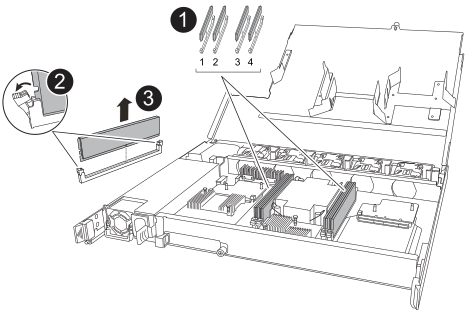

= Replace a DIMM - NX224 shelves
:icons: font
:imagesdir: ../media/

[.lead]
You can replace a faulty DIMM nondisruptively in an NX224 drive shelf that is powered on, and while I/O is in progress.

.Before you begin

* The shelf's partner NSM must be up and running, and be cabled correctly so that your shelf maintains connectivity when you remove the NSM with the failed FRU (target NSM).
+
https://mysupport.netapp.com/site/tools/tool-eula/activeiq-configadvisor[NetApp Downloads: Config Advisor^]

* All other components in the system, including the other three DIMMs in the NSM100 module and one DIMM in the NSM100B module, must be functioning properly.

.About this task

* Allow at least 70 seconds between removal and installation of the NVMe shelf module (NSM).
+
This allows enough time for ONTAP to process NSM removal event.

* *Best practice:* The best practice is to have current versions of NVMe shelf module (NSM) firmware and drive firmware on your system before replacing FRU components.
+
https://mysupport.netapp.com/site/downloads/firmware/disk-shelf-firmware[NetApp Downloads: Disk Shelf Firmware^]
+
https://mysupport.netapp.com/site/downloads/firmware/disk-drive-firmware[NetApp Downloads: Disk Drive Firmware^]
+
[NOTE]
====
Do not revert firmware to a version that does not support your shelf and its components.

====
* If needed, you can turn on the shelf's location (blue) LEDs to aid in physically locating the affected shelf: `storage shelf location-led modify -shelf-name _shelf_name_ -led-status on`
+
If you do not know the `_shelf_name_` of the affected shelf, run the `storage shelf show` command.
+
A shelf has three location LEDs: one on the operator display panel and one on each NSM. Location LEDs remain illuminated for 30 minutes. You can turn them off by entering the same command, but using the `off` option.

* When you unpack the replacement DIMM, save all packing materials for use when you return the failed DIMM.
+
If you need the RMA number or additional help with the replacement procedure, contact technical support at https://mysupport.netapp.com/site/global/dashboard[NetApp Support^], 888-463-8277 (North America), 00-800-44-638277 (Europe), or +800-800-80-800 (Asia/Pacific).

.Steps

. Properly ground yourself.
. Disconnect the cabling from the NSM that contains the FRU that you are replacing:
 .. Disconnect the power cord from the power supply by opening the power cord retainer if it is an AC power supply, or unscrewing the two thumb screws if it is a DC power supply, and then unplug the power cord from the power supply.
+
Power supplies do not have a power switch.

 .. Disconnect the storage cabling from the NSM ports.
+
Make a note of the NSM ports that each cable is connected to. You reconnect the cables to the same ports when you reinsert the NSM, later in this procedure.

include::../_include/t_module_reinstall.adoc[]

. Open the NSM cover by turning the thumbscrew counterclockwise to loosen, and then open the cover.

+
The FRU label on the NSM cover shows the location of the two DIMMs and two DIMM Blanks in the NSM.

. Physically identify the faulty DIMM.
+
When a DIMM is faulty, the system logs a warning message to the system console indicating which DIMM needs to be replaced.
//05Oct2022, Racer5: removed text describing location of onboard attention LED.

. Remove the faulty DIMM:
+

+
[cols="1,4"]
|===
a|
image::../media/icon_round_1.png[Callout number 1]
a|
DIMM slot numbering and positions.

The NSM contains DIMMs in slots 1 and 3, and DIMM Blanks in slots 2 and 4.
a|
image::../media/icon_round_2.png[Callout number 2]
a|
* Note the orientation of the DIMM in the socket so that you can insert the replacement DIMM using the same orientation.
* Eject the faulty DIMM by slowly pushing apart the two DIMM ejector tabs on both ends of the DIMM slot.

IMPORTANT: Carefully hold the DIMM by the corners or edges to avoid pressure on the DIMM circuit board components.
a|
image::../media/icon_round_3.png[Callout number 3]
a|
Lift the DIMM up and out of the slot.

The ejector tabs remain in the open position.
|===

. Replace the DIMM:
 .. Remove the replacement DIMM from its antistatic shipping bag.
 .. Hold the DIMM by the corners, and then insert the DIMM squarely into a slot.
+
The notch on the bottom of the DIMM, among the pins, should line up with the tab in the slot.
+
When inserted correctly, the DIMM should go in easily but fit tightly in the slot. If not, reinsert the DIMM.

 .. Push down carefully, but firmly, on the top edge of the DIMM until the ejector tabs snap into place over the notches at both ends of the DIMM.
. Close the NSM cover, and then tighten the thumb screw.

include::../_include/t_module_reinstall.adoc[]

. Reconnect the cabling to the NSM:
 .. Reconnect the storage cabling to the same two NSM ports.
+
Cables are inserted with the connector pull-tab facing up. When a cable is inserted correctly, it clicks into place.

 .. Reconnect the power cord to the power supply, and then secure the power cord with the power cord retainer if it is an AC power supply, or tighten the two thumb screws if it is a DC power supply.
+
When functioning correctly, a power supply's bicolored LED illuminates green.
+
Additionally, both NSM port LNK (green) LEDs illuminate. If a LNK LED does not illuminate, reseat the cable.
. Verify that the attention (amber) LEDs on the NSM containing the failed DIMM and the shelf operator display panel are no longer illuminated.
+
The NSM attention LEDs turn off after the NSM reboots and no longer detects a DIMM issue. This can take three to five minutes.

. Verify that the NSM is cabled correctly, by running Active IQ Config Advisor.
+
If any cabling errors are generated, follow the corrective actions provided.
+
https://mysupport.netapp.com/site/tools/tool-eula/activeiq-configadvisor[NetApp Downloads: Config Advisor^]
