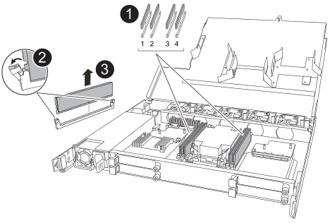
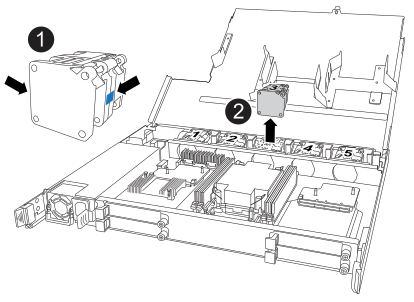

= Replace an NSM - NX224 shelves
:icons: font
:imagesdir: ../media/

[.lead]
You can replace an impaired NVMe shelf module (NSM) nondisruptively in an NX224 drive shelf that is powered on, and while I/O is in progress.

.About this task

* Replacing the NSM involves moving the DIMMs, fans, boot media, I/O module, and power supply from the impaired NSM to the replacement NSM.
+
You do not move the real-time clock (RTC) battery. They come preinstalled in the replacement NSM.

* Allow at least 70 seconds between removal and installation of the NVMe shelf module (NSM).
+
This allows enough time for ONTAP to process the NSM removal event.

* *Best practice:* The best practice is to have current versions of NVMe shelf module (NSM) firmware and drive firmware on your system before replacing FRU components. You can visit the NetApp Support Site to https://mysupport.netapp.com/site/downloads/firmware/disk-shelf-firmware[download disk shelf firmware^] and https://mysupport.netapp.com/site/downloads/firmware/disk-drive-firmware[download disk drive firmware^].
+
[NOTE]
====
Do not revert firmware to a version that does not support your shelf and its components.
====

* Shelf (NSM) firmware is automatically updated (nondisruptively) on a new NSM that has a non-current firmware version.
+
NSM firmware checks occur every 10 minutes. An NSM firmware update can take up to 30 minutes.

* If needed, you can turn on the shelf's location (blue) LEDs to aid in physically locating the affected shelf: `storage shelf location-led modify -shelf-name _shelf_name_ -led-status on`
+
If you do not know the `shelf_name` of the affected shelf, run the `storage shelf show` command.
+
A shelf has three location LEDs: one on the operator display panel and one on each NSM. Location LEDs remain illuminated for 30 minutes. You can turn them off by entering the same command, but using the `off` option.

* When you unpack the replacement NSM, save all packing materials for use when you return the failed NSM.
+
If you need the RMA number or additional help with the replacement procedure, contact technical support at https://mysupport.netapp.com/site/global/dashboard[NetApp Support^], 888-463-8277 (North America), 00-800-44-638277 (Europe), or +800-800-80-800 (Asia/Pacific).

.Before you begin

* The shelf's partner NSM must be up and running, and be cabled correctly so that your shelf maintains connectivity when you remove the failed NSM. You can verify the partner NSM's status by https://mysupport.netapp.com/site/tools/tool-eula/activeiq-configadvisor[downloading and running Config Advisor^].

* All other components in the system must be functioning properly.

.Steps

. Properly ground yourself.
. Physically identify the impaired NSM.
+
The system logs a warning message to the system console indicating which module is impaired. Additionally, the attention (amber) LED on the drive shelf operator display panel and the impaired module illuminate.

. Disconnect the cabling from the impaired NSM:
 .. Disconnect the power cord from the power supply by opening the power cord retainer and then unplugging the power cord from the power supply.
+
Power supplies do not have a power switch.

 .. Disconnect the storage cabling from the NSM ports.
+
Make a note of the NSM ports that each cable is connected to. You reconnect the cables to the same ports on the replacement NSM, later in this procedure.

include::../_include/t_module_remove.adoc[]

. Unpack the replacement NSM, and set it on a level surface near the impaired NSM.
. Open the covers of both NSMs by loosening the thumbscrew on each cover.

. Move the DIMMs from the impaired NSM to the replacement to the replacement NSM:
.. Remove DIMM from the impaired NSM:
+

+
[cols="1,4"]
|===
a|
image::../media/icon_round_1.png[Callout number 1]
a|
DIMM slot numbering and positions.

a|
image::../media/icon_round_2.png[Callout number 2]
a|
* Note the orientation of the DIMM in the socket so that you can insert it into the replacement DIMM using the same orientation.
* Eject the faulty DIMM by slowly pushing apart the two DIMM ejector tabs on both ends of the DIMM slot.

IMPORTANT: Carefully hold the DIMM by the corners or edges to avoid pressure on the DIMM circuit board components.
a|
image::../media/icon_round_3.png[Callout number 3]
a|
Lift the DIMM up and out of the slot.

The ejector tabs remain in the open position.
|===

.. Install DIMM in the replacement NSM:
 ... Hold the DIMM by the corners, and then insert the DIMM squarely into a slot.
+
The notch on the bottom of the DIMM, among the pins, should line up with the tab in the slot.
+
When inserted correctly, the DIMM should go in easily but fit tightly in the slot. If not, reinsert the DIMM.

 ... Push down carefully, but firmly, on the top edge of the DIMM until the ejector tabs snap into place over the notches at both ends of the DIMM.
 ... Repeat for the other DIMM.

. Move all fans from the impaired NSM to the replacement NSM:
+

+
[cols="1,4"]
|===
a|
image::../media/icon_round_1.png[Callout number 1]
a|

Remove the failed fan by firmly grasping the sides where the blue touch points are located, and then pull it straight up out of its socket.

a|
image::../media/icon_round_1.png[Callout number 2]
a|

Insert the replacement fan by aligning it within the guides, and then push down until the fan connector is fully seated in the socket.
|===

. Move the boot media to the replacement NSM:
.. Remove the boot media from the impaired NSM:
+
image::../media/drw_tp_boot_media_replace_ieops-2201.svg[Remove boot media.]
+
[cols="1,4"]
|===
a|
image::../media/icon_round_1.png[Callout number 1]
a|
Boot media location
a|
image::../media/icon_round_2.png[Callout number 2]
a|
Press down on the blue tab to release the right end of the boot media.
a|
image::../media/icon_round_3.png[Callout number 3]
a|
Lift the right end of the boot media up at a slight angle to get a good grip along the sides of the boot media.
a|
image::../media/icon_round_4.png[Callout number 4]
a|
Gently pull the left end of the boot media out of its socket.
|===

.. Install the boot media in the replacement NSM:
... Align the edges of the boot media with the socket housing in the replacement NSM, and then gently push it squarely into the socket.
... Rotate the boot media down toward the locking button.
... Push the locking button, rotate the boot media all the way down, and then release the locking button.

. Move all four I/O modules from the impaired NSM to the replacement NSM.
.. Remove each I/O module from the impaired NSM:
+
image::../media/drw_tp_io_module_replace_ieops-2204.svg[Replace the I/O module.]
+
[cols="1,4"]
|===
a|
image::../media/icon_round_1.png[Callout number 1]
a|
Turn the I/O module thumbscrew counterclockwise to loosen.
a|
image::../media/icon_round_2.png[Callout number 2]
a|
Pull the I/O module out of the NSM using the port label tab on the left and the thumbscrew.
|===

.. Install each I/O module in the replacement NSM:

... Align the I/O module with the edges of the slot in the replacement NSM.
... Gently push the I/O module all the way into the slot, making sure to properly seat the module into the connector.
+
You can use the tab on the left and the thumbscrew to push in the I/O module.

. Close the cover of each NSM, and then tighten each thumbscrew.

. Move the power supply from the impaired NSM to the replacement NSM:
 .. Rotate the handle up, to its horizontal position, and then grasp it.
 .. With your thumb, press the terra-cotta tab to release the locking mechanism.
 .. Pull the power supply out of the NSM while using your other hand to support its weight.
 .. Using both hands, support and align the edges of the power supply with the opening in the replacement NSM.
 .. Gently push the power supply into the NSM until the locking mechanism clicks into place.
+
NOTE: Do not use excessive force or you might damage the internal connector.
 .. Rotate the handle down, so it is out of the way of normal operations.

include::../_include/t_module_reinstall.adoc[]

. Reconnect the cabling to the NSM:
 .. Reconnect the storage cabling to the same two NSM ports.
+
Cables are inserted with the connector pull-tab facing up. When a cable is inserted correctly, it clicks into place.

 .. Reconnect the power cord to the power supply, and then secure the power cord with the power cord retainer.
+
When functioning correctly, a power supply's bicolored LED illuminates green.
+
Additionally, both NSM port LNK (green) LEDs illuminate. If a LNK LED does not illuminate, reseat the cable.
. Verify that the attention (amber) LED on the shelf operator display panel is no longer illuminated.
+
The operator display panel attention LED turns off after the NSM reboots. This can take three to five minutes.

. Verify that the NSM is cabled correctly, by https://mysupport.netapp.com/site/tools/tool-eula/activeiq-configadvisor[running Active IQ Config Advisor^].
+
If any cabling errors are generated, follow the corrective actions provided.

. Make sure that both NSMs in the shelf are running the same version of firmware: version 0300 or later.
